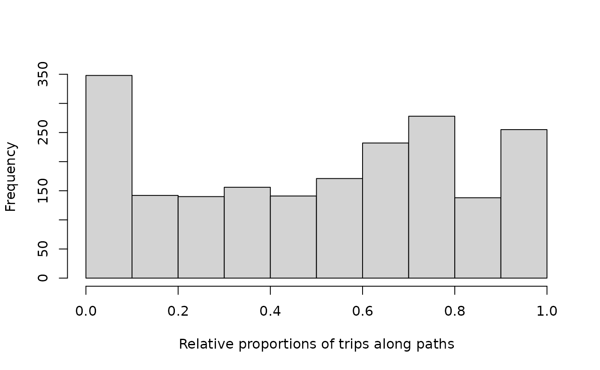
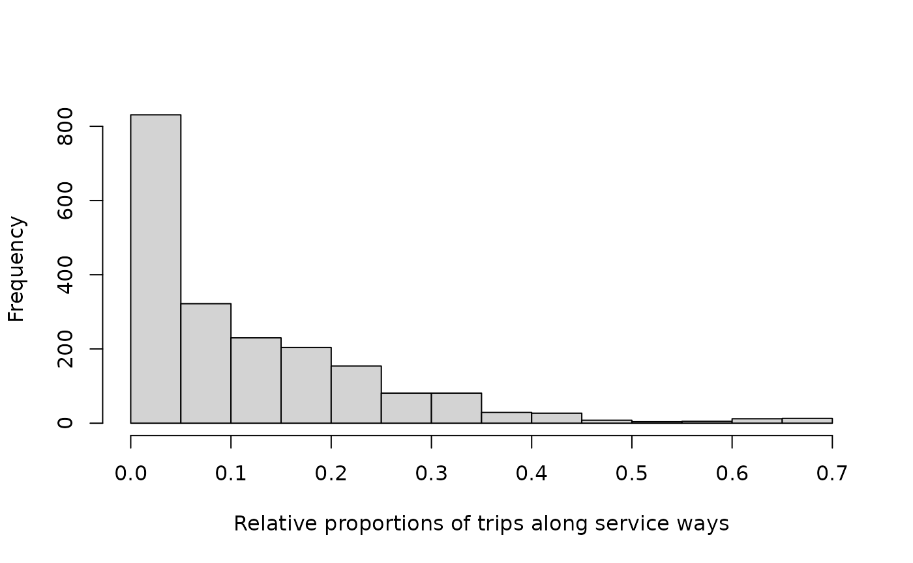

# Aggregating distances along categories of edges

The [`dodgr_dists_categorical`
function](https://UrbanAnalyst.github.io/dodgr/reference/dodgr_dists_categorical.html)
enables multiple distances to be aggregated along distinct categories of
edges with a single query. This is particularly useful to examine
information on proportions of total distances routed along different
edge categories. The following three sub-sections describe the three
main uses and interfaces of the [`dodgr_dists_categorical`
function](https://UrbanAnalyst.github.io/dodgr/reference/dodgr_dists_categorical.html).
Each of these requires an input `graph` to have an additional column
named `"edge_type"`, which labels discrete categories of edges. These
can be any kind of discrete labels at all, from integer values to
character labels or factors. The labels are retained in the result, as
demonstrated below.

## 1 Full Distance Information for Edge Categories

The “default” interface of the [`dodgr_dists_categorical`
function](https://UrbanAnalyst.github.io/dodgr/reference/dodgr_dists_categorical.html)
requires the same three mandatory parameters as
[`dodgr_distances`](https://UrbanAnalyst.github.io/dodgr/reference/dodgr_dists.html),
of

1.  A weighted `graph` on which the distances are to be calculated;
2.  A vector of `from` points from which distances are to be calculated;
    and
3.  A corresponding vector of `to` points.

As for
[`dodgr_distances`](https://UrbanAnalyst.github.io/dodgr/reference/dodgr_dists.html),
the `from` and `to` arguments can be either vertex identifiers
(generally as `from_id` and `to_id` columns of the input `graph`), or
two-column coordinates for spatial graphs. The following code
illustrates the procedure, using the internal data set,
[`hampi`](https://UrbanAnalyst.github.io/dodgr/reference/hampi.html),
from the settlement of Hampi in the middle of a national park in the
Deccan Plains of India. The following code also reduces the network to
the largest connected component only, to ensure all points are mutually
reachable.

``` r
graph <- weight_streetnet (hampi, wt_profile = "foot")
graph <- graph [graph$component == 1, ]
graph$edge_type <- graph$highway
table (graph$edge_type)
```

    ## 
    ##         path      primary  residential    secondary      service        steps 
    ##         2767          106           32          560          184           28 
    ##        track unclassified 
    ##          518          454

That network then has 8 distinct edge types. Submitting this graph to
the function, and calculating pairwise distances between all points,
then gives the following result:

``` r
v <- dodgr_vertices (graph)
from <- to <- v$id
d <- dodgr_dists_categorical (graph, from, to)
class (d)
```

    ## [1] "list"                    "dodgr_dists_categorical"

``` r
length (d)
```

    ## [1] 9

``` r
sapply (d, dim)
```

    ##      distances path primary residential secondary service steps track
    ## [1,]      2270 2270    2270        2270      2270    2270  2270  2270
    ## [2,]      2270 2270    2270        2270      2270    2270  2270  2270
    ##      unclassified
    ## [1,]         2270
    ## [2,]         2270

The result has the dedicated class, `dodgr_dists_categorical`, which it
itself a list of matrices, one for each distinct edge type. This class
enables a convenient `summary` method which converts data on aggregate
distances along each category of edges into overall proportions:

``` r
summary (d)
```

    ## Proportional distances along each kind of edge:
    ##   path: 0.5133
    ##   primary: 0.016
    ##   residential: 4e-04
    ##   secondary: 0.1561
    ##   service: 0.0607
    ##   steps: 0.0018
    ##   track: 0.1018
    ##   unclassified: 0.1499

Those statistics clearly highlight the fact that Hampi is a pedestrian
town - most ways are either paths or tracks, with a new “secondary” ways
for access vehicles.

## 2. Proportional Distances along each Edge Category

If `summary` results like those immediately above are all that is
desired, then a `proportions_only` parameter can be used in the
[`dodgr_dists_categorical()`](https://UrbanAnalyst.github.io/dodgr/reference/dodgr_dists_categorical.md)
function to directly return those:

``` r
dodgr_dists_categorical (graph, from, to,
                         proportions_only = TRUE)
```

    ##         path      primary  residential    secondary      service        steps 
    ## 0.5132876816 0.0160100421 0.0004094553 0.1561029152 0.0606822224 0.0018216492 
    ##        track unclassified 
    ## 0.1017594638 0.1499265705

Queries with `proportions_only = TRUE` are constructed in a different
way in the underlying C++ code that avoids storing the full list of
matrices in memory. For most jobs, this should translate to faster
queries, as illustrated in the following benchmark:

``` r
bench::mark (full = dodgr_dists_categorical (graph, from, to),
             prop_only = dodgr_dists_categorical (graph, from, to,
                                                  proportions_only = TRUE),
             check = FALSE, time_unit = "s") [, 1:3]
```

    ## # A tibble: 2 × 3
    ##   expression   min median
    ##   <bch:expr> <dbl>  <dbl>
    ## 1 full       0.450  0.451
    ## 2 prop_only  0.267  0.274

The default value of `proportions_only = FALSE` should be used only if
additional information from the distance matrices themselves is required
or desired. Examples of such additional information include parameters
quantifying the distributions of the various distance metrics, as
further examined below.

## 3. Proportional Distances within a Threshold Distance

The third and final use of the [`dodgr_dists_categorical`
function](https://UrbanAnalyst.github.io/dodgr/reference/dodgr_dists_categorical.html)
is through the `dlimit` parameter, used to specify a distance threshold
below which categorical distances are to be aggregated. This is useful
to examine relative proportions of different edges types necessary in
travelling in any and all directions away from each point or vertex of a
graph.

When a `dlimit` parameter is specified, the `to` parameter is ignored,
and distances are aggregated along all possible routes away from each
`from` point, out to the specified `dlimit`. The value of `dlimit` must
be specified relative to the edge distance values contained in the input
graph. For spatial graphs obtained with [`dodgr_streetnet()` or
`dodgr_streetnet_sc()`](https://UrbanAnalyst.github.io/dodgr/reference/dodgr_streetnet.html),
for example, as well as the internal [`hampi`
data](https://UrbanAnalyst.github.io/dodgr/reference/hampi.html), these
distances are in metres, and so `dlimit` must be specified in metres.

The result is then a single matrix in which each row represents one of
the `from` points, and there is one column of aggregate distances for
each edge type, plus an initial column of overall distances. The
following code illustrates:

``` r
dlimit <- 2000 # in metres
d <- dodgr_dists_categorical (graph, from, dlimit = dlimit)
dim (d)
```

    ## [1] 2270    9

``` r
head (d)
```

    ##             distance     path primary residential secondary   service steps
    ## 339318500  12085.012 9382.223       0           0         0 2617.6145     0
    ## 339318502   4136.151 3522.017       0           0         0  614.1342     0
    ## 2398958028  4153.900 3539.766       0           0         0  614.1342     0
    ## 1427116077  6173.306 5144.681       0           0         0  961.4988     0
    ## 7799710916  4191.346 3577.212       0           0         0  614.1342     0
    ## 339318503   6215.252 5601.117       0           0         0  614.1342     0
    ##            track unclassified
    ## 339318500      0     85.17409
    ## 339318502      0      0.00000
    ## 2398958028     0      0.00000
    ## 1427116077     0     67.12613
    ## 7799710916     0      0.00000
    ## 339318503      0      0.00000

The row names of the resultant `data.frame` are the vertex identifiers
specified in the `from` parameter. Such results can easily be combined
with spatial information on the vertices obtained from the
[`dodgr_vertices()`
function](https://UrbanAnalyst.github.io/dodgr/reference/dodgr_vertices.html)
to generate spatial maps of relative proportions around each point in a
graph or network. Summary statistics can also readily be extracted, for
example,

``` r
hist (d$path / d$distance,
      xlab = "Relative proportions of trips along paths", main = "")
```



Trips along paths are roughly evenly distributed between 0 and 1. In
contrast, proportions of trips along service ways – used to facilitate
motorised vehicular access in the otherwise car-free area of Hampi,
India – are distinctly different:

``` r
hist (d$service / d$distance,
      xlab = "Relative proportions of trips along service ways", main = "")
```



These distributions provide more detailed and nuanced insights than
those provided by the overall `summary` functions above, which only
revealed overall respective relative proportions of 0.51 and 0.06 for
paths and service ways. The results within the distance threshold reveal
that the distributional forms of proportional distances differ as much
as the aggregate values, and that both aspects of the function provide
distinct insights into proportional distances along categories of edge
types.

Finally, this use of the function also utilizes distinct difference in
the underlying C++ code that are even more efficient that the previous
case of proportional distances. The following code benchmarks the three
modes:

``` r
bench::mark (full = dodgr_dists_categorical (graph, from, to),
             prop_only = dodgr_dists_categorical (graph, from, to,
                                                  proportions_only = TRUE),
             dlimit = dodgr_dists_categorical (graph, from, dlimit = 2000),
             check = FALSE, time_unit = "s") [, 1:3]
```

    ## # A tibble: 3 × 3
    ##   expression    min median
    ##   <bch:expr>  <dbl>  <dbl>
    ## 1 full       0.451  0.452 
    ## 2 prop_only  0.264  0.264 
    ## 3 dlimit     0.0687 0.0715

Finally, note that the efficiency of distance-threshold queries scales
non-linearly with increases in `dlimit`, with queries quickly becoming
less efficient for larger values of `dlimit`.
