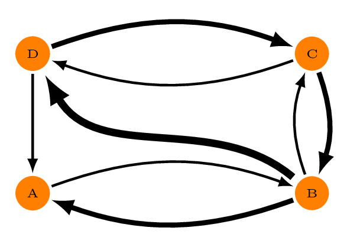
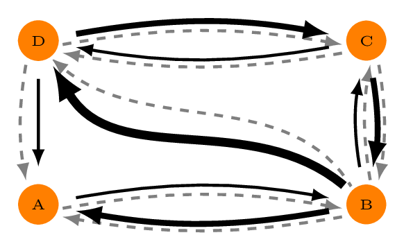
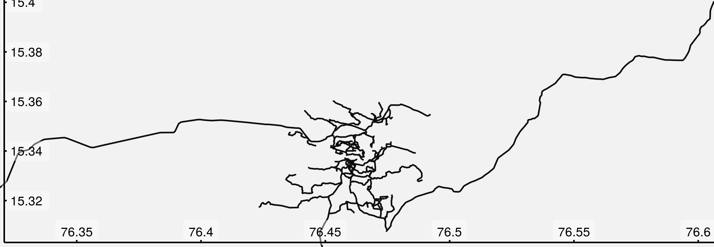
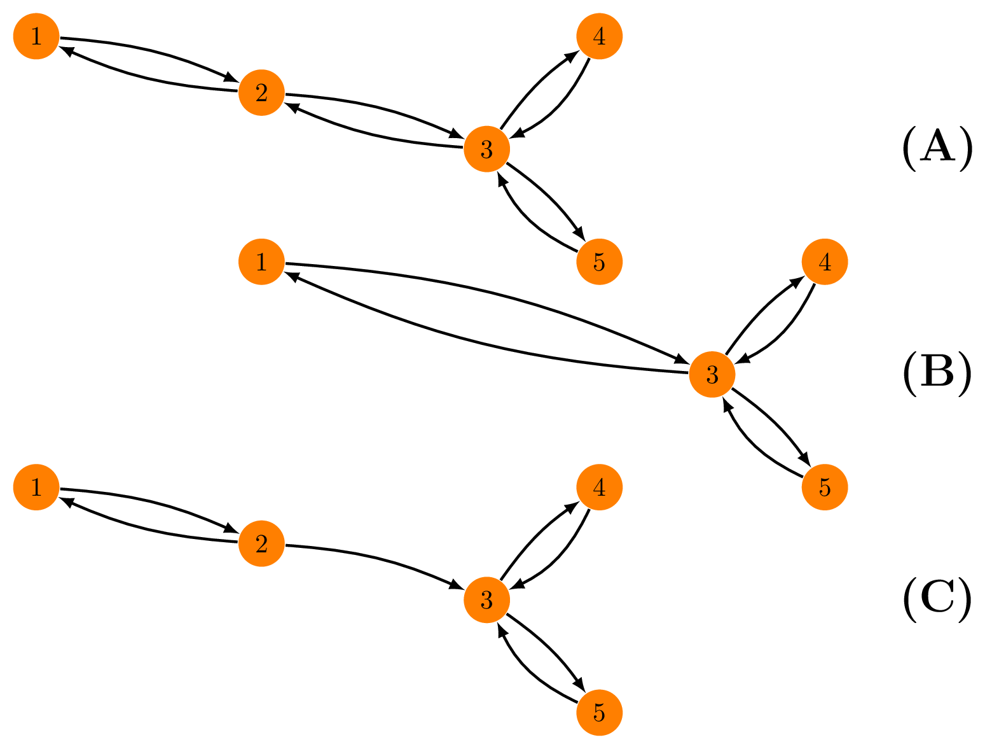

# dodgr

## 1 Background: Directed Graphs

`dodgr` is an **R** package for calculating **D**istances **O**n
**D**irected **Gr**aphs. It does so very efficiently, and is able to
process larger graphs than many other comparable **R** packages. Skip
straight to the Intro if you know what directed graphs are (but maybe
make a brief stop-in to Dual-Weighted Directed Graphs below.) Directed
graphs are ones in which the “distance” (or some equivalent measure)
from A to B is not necessarily equal to that from B to A. In Fig. 1, for
example, the weights between the graph vertices (A, B, C, and D) differ
depending on the direction of travel, and it is only possible to
traverse the entire graph in an anti-clockwise direction.



Graphs in `dodgr` are represented by simple flat `data.frame` objects,
so the graph of Fig. 1, presuming the edge weights to take values of 1,
2, and 3, would be,

    ##   from to d
    ## 1    A  B 1
    ## 2    B  A 2
    ## 3    B  C 1
    ## 4    B  D 3
    ## 5    C  B 2
    ## 6    C  D 1
    ## 7    D  C 2
    ## 8    D  A 1

The primary function of `dodgr` is `dodgr_dists`, which calculates
pair-wise shortest distances between all vertices of a graph.

``` r
dodgr_dists (graph)
```

    ##   A B C D
    ## A 0 1 2 3
    ## B 2 0 1 2
    ## C 2 2 0 1
    ## D 1 2 2 0

``` r
dodgr_dists (graph, from = c ("A", "C"), to = c ("B", "C", "D"))
```

    ##   B C D
    ## A 1 2 3
    ## C 2 0 1

### 1.1 Dual-Weighted Directed Graphs

Shortest-path distances on weighted graphs can be calculated using a
number of other **R** packages, such as
[`igraph`](https://cran.r-project.org/package=igraph) or
[`e1071`](https://cran.r-project.org/package=e1071). `dodgr` comes into
its own through its ability to trace paths through *dual-weighted*
directed graphs, illustrated in Fig. 2.



Dual-weighted directed graphs are common in many areas, a foremost
example being routing through street networks. Routes through street
networks depends on mode of transport: the route a pedestrian might take
will generally differ markedly from the route the same person might take
if behind the wheel of an automobile. Routing through street networks
thus generally requires each edge to be specified with two weights or
distances: one quantifying the physical distance, and a second weighted
version reflecting the mode of transport (or some other preferential
weighting).

`dodgr` calculates shortest paths using one set of weights (called
“weights” or anything else starting with “w”), but returns the actual
lengths of them using a second set of weights (called “distances”, or
anything else starting with “d”). If no weights are specified, distances
alone are used both for routing and final distance calculations.
Consider that the weights and distances of Fig. 2 are the black and grey
lines, respectively, with the latter all equal to one. In this case, the
graph and associated shortest distances are,

    ##   from to w d
    ## 1    A  B 1 1
    ## 2    B  A 2 1
    ## 3    B  C 1 1
    ## 4    B  D 3 1
    ## 5    C  B 2 1
    ## 6    C  D 1 1
    ## 7    D  C 2 1
    ## 8    D  A 1 1

    ##   A B C D
    ## A 0 1 2 2
    ## B 1 0 1 1
    ## C 2 1 0 1
    ## D 1 2 1 0

Note that even though the shortest “distance” from A to D is actually
A$\rightarrow$B$\rightarrow$D with a distance of only 2, that path has a
weighted distance of 1 + 3 = 4. The shortest *weighted* path is
A$\rightarrow$B$\rightarrow$C$\rightarrow$D, with a distance both
weighted and unweighted of 1 + 1 + 1 = 3. Thus `d(A,D) = 3` and not 2.

## 2 Introduction to `dodgr`

Although the package has been intentionally developed to be adaptable to
any kinds of networks, most of the applications illustrated here concern
street networks, and also illustrate several helper functions the
package offers for working with street networks. The basic `graph`
object of `dodgr` is nevertheless arbitrary, and need only minimally
contain three or four columns as demonstrated in the simple examples at
the outset.

The package may be used to calculate a matrix of distances between a
given set of geographic coordinates. We can start by simply generating
some random coordinates, in this case within the bounding box defining
the city of York in the U.K.

``` r
bb <- osmdata::getbb ("york uk")
npts <- 1000
xy <- apply (bb, 1, function (i) min (i) + runif (npts) * diff (i))
bb; head (xy)
```

    ##         min        max
    ## x -1.241536 -0.9215361
    ## y 53.799056 54.1190555

    ##               x        y
    ## [1,] -1.1713502 53.89409
    ## [2,] -1.2216108 54.01065
    ## [3,] -1.0457199 53.83613
    ## [4,] -0.9384666 53.93545
    ## [5,] -0.9445541 53.89436
    ## [6,] -1.1207099 54.01262

The following lines download the street network within that bounding
box, weight it for pedestrian travel, and use the weighted network to
calculate the pairwise distances between all of the `xy`points.

``` r
net <- dodgr_streetnet (bb)
net <- weight_streetnet (net, wt_profile = "foot")
system.time (
            d <- dodgr_dists (net, from = xy, to = xy)
            )
```

    ##    user  system elapsed 
    ##  38.828   0.036   5.424

``` r
dim (d); range (d, na.rm = TRUE)
```

    ## [1] 1000 1000

    ## [1]     0.00 57021.18

The result is a matrix of 1000-by-1000 distances of up to 57km long,
measured along routes weighted for optimal pedestrian travel. In this
case, the single call to
[`dodgr_distances()`](https://UrbanAnalyst.github.io/dodgr/reference/dodgr_distances.html)
automatically downloaded the entire street network of York and
calculated one million shortest-path distances, all in under 30 seconds.

## 3 Graphs and Street Networks

Although the above code is short and fast, most users will probably want
more control over their graphs and routing possibilities. To illustrate,
the remainder of this vignette analyses the much smaller street network
of Hampi, Karnataka, India, included in the `dodgr` package as the
dataset
[`hampi`](https://UrbanAnalyst.github.io/dodgr/reference/hampi.html).
This data set may be re-created with the following single line:

``` r
hampi <- dodgr_streetnet ("hampi india")
```

Or with the equivalent version bundled with the package:

``` r
class (hampi)
```

    ## [1] "sf"         "data.frame"

``` r
class (hampi$geometry)
```

    ## [1] "sfc_LINESTRING" "sfc"

``` r
dim (hampi)
```

    ## [1] 236  15

The `streetnet` is an [`sf`](https://cran.r-project.org/package=sf)
(Simple Features) object containing 189 `LINESTRING` geometries. In
other words, it’s got an `sf` representation of 189 street segments. The
**R** package [`osmplotr`](https://docs.ropensci.org/osmplotr/) can be
used to visualise this street network (with the help of `magrittr` pipe
operator, `%>%`):

``` r
library (osmplotr)
library (magrittr)
map <- osm_basemap (hampi, bg = "gray95") %>%
    add_osm_objects (hampi, col = "gray5") %>%
    add_axes () %>%
    print_osm_map ()
```



The `sf` class data representing the street network of Hampi can then be
converted into a flat `data.frame` object by

``` r
graph <- weight_streetnet (hampi, wt_profile = "foot")
dim (graph)
```

    ## [1] 6813   15

``` r
head (graph)
```

    ##   geom_num edge_id    from_id from_lon from_lat      to_id   to_lon   to_lat
    ## 1        1       1  339318500 76.47491 15.34167  339318502 76.47612 15.34173
    ## 2        1       2  339318502 76.47612 15.34173  339318500 76.47491 15.34167
    ## 3        1       3  339318502 76.47612 15.34173 2398958028 76.47621 15.34174
    ## 4        1       4 2398958028 76.47621 15.34174  339318502 76.47612 15.34173
    ## 5        1       5 2398958028 76.47621 15.34174 1427116077 76.47628 15.34179
    ## 6        1       6 1427116077 76.47628 15.34179 2398958028 76.47621 15.34174
    ##            d d_weighted highway   way_id component      time time_weighted
    ## 1 129.761207 129.761207    path 28565950         1 93.428069     93.428069
    ## 2 129.761207 129.761207    path 28565950         1 93.428069     93.428069
    ## 3   8.874244   8.874244    path 28565950         1  6.389455      6.389455
    ## 4   8.874244   8.874244    path 28565950         1  6.389455      6.389455
    ## 5   9.311222   9.311222    path 28565950         1  6.704080      6.704080
    ## 6   9.311222   9.311222    path 28565950         1  6.704080      6.704080

Note that the actual graph contains around 30 times as many edges as
there are streets, indicating that each street is composed on average of
around 30 individual segments. The individual points or vertices from
those segments can be extracted with,

``` r
vt <- dodgr_vertices (graph)
head(vt)
```

    ##            id        x        y component n
    ## 1   339318500 76.47491 15.34167         1 0
    ## 2   339318502 76.47612 15.34173         1 1
    ## 4  2398958028 76.47621 15.34174         1 2
    ## 6  1427116077 76.47628 15.34179         1 3
    ## 8  7799710916 76.47634 15.34184         1 4
    ## 10  339318503 76.47641 15.34190         1 5

``` r
dim (vt)
```

    ## [1] 3337    5

From which we see that the OpenStreetMap representation of the streets
of Hampi has 189 line segments with 2,987 unique points and 6,096 edges
between those points. The number of edges per vertex in the entire
network is thus,

``` r
nrow (graph) / nrow (vt)
```

    ## [1] 2.041654

A simple straight line has two edges between all intermediate nodes, and
this thus indicates that the network in it’s entirety is quite simple.
The `data.frame` resulting from
[`weight_streetnet()`](https://UrbanAnalyst.github.io/dodgr/reference/weight_streetnet.html)
is what `dodgr` uses to calculate shortest path routes, as will be
described below, following a brief description of weighting street
networks.

### 3.1 Graph Components

The foregoing `graph` object returned from
[`weight_streetnet()`](https://UrbanAnalyst.github.io/dodgr/reference/weight_streetnet.html)
also includes a `$component` column enumerating all of the distinct
inter-connected components of the graph.

``` r
table (graph$component)
```

    ## 
    ##    1    2    3 
    ## 4649 2066   98

Components are numbered in order of decreasing size, with
`$component = 1` always denoting the largest component. In this case,
that component contains 3,934 edges, representing 65% of the graph.
There are clearly only three distinct components, but this number may be
much larger for larger graphs, and may be obtained from,

``` r
length (unique (graph$component))
```

    ## [1] 3

Component numbers can be determined for any types of graph with the
[`dodgr_components()`](https://UrbanAnalyst.github.io/dodgr/reference/dodgr_components.html)
function. For example, the following lines reduce the previous graph to
a minimal (non-spatial) structure of four columns, and then
(re-)calculate a fifth column of `$component`s:

``` r
cols <- c ("edge_id", "from_id", "to_id", "d")
graph_min <- graph [, which (names (graph) %in% cols)]
graph_min <- dodgr_components (graph_min)
head (graph_min)
```

    ##   edge_id    from_id      to_id          d component
    ## 1       1  339318500  339318502 129.761207         1
    ## 2       2  339318502  339318500 129.761207         1
    ## 3       3  339318502 2398958028   8.874244         1
    ## 4       4 2398958028  339318502   8.874244         1
    ## 5       5 2398958028 1427116077   9.311222         1
    ## 6       6 1427116077 2398958028   9.311222         1

The `component` column column can be used to select or filter any
component in a graph. It is particularly useful to ensure routing
calculations consider only connected vertices through simply removing
all minor components:

``` r
graph_connected <- graph [graph$component == 1, ]
```

This is explored further below (under Distance Matrices).

### 3.2 Weighting Profiles

Dual-weights for street networks are generally obtained by multiplying
the distance of each segment by a weighting factor reflecting the type
of highway. As demonstrated above, this can be done easily within
`dodgr` with the
[`weight_streetnet()`](https://UrbanAnalyst.github.io/dodgr/reference/weight_streetnet.html)
function, which applies the named weighting profiles included with the
`dodgr` package to OpenStreetMap networks extracted with the
[`osmdata`](https://cran.r-project.org/package=osmdata) package.

This function uses the internal data
[`dodgr::weighting_profiles`](https://UrbanAnalyst.github.io/dodgr/reference/weighting_profiles.html),
which is a list of three items:

1.  `weighting_profiles`;
2.  `surface_speeds`; and
3.  `penalties`

Most of these data are used to calculate routing times with the
`dodgr_times` function, as detailed in an additional vignette. The only
aspects relevant for distances are the profiles themselves, which assign
preferential weights to each distinct type of highway.

``` r
wp <- weighting_profiles$weighting_profiles
names (wp)
```

    ## [1] "name"      "way"       "value"     "max_speed"

``` r
class (wp)
```

    ## [1] "data.frame"

``` r
unique (wp$name)
```

    ##  [1] "foot"       "horse"      "wheelchair" "bicycle"    "moped"     
    ##  [6] "motorcycle" "motorcar"   "goods"      "hgv"        "psv"

``` r
wp [wp$name == "foot", ]
```

    ##    name            way value max_speed
    ## 1  foot       motorway  0.00        NA
    ## 2  foot          trunk  0.40        NA
    ## 3  foot        primary  0.50         5
    ## 4  foot      secondary  0.60         5
    ## 5  foot       tertiary  0.70         5
    ## 6  foot   unclassified  0.80         5
    ## 7  foot    residential  0.90         5
    ## 8  foot        service  0.90         5
    ## 9  foot          track  0.95         5
    ## 10 foot       cycleway  0.95         5
    ## 11 foot           path  1.00         5
    ## 12 foot          steps  0.80         2
    ## 13 foot          ferry  0.20         5
    ## 14 foot  living_street  0.95         5
    ## 15 foot      bridleway  1.00         5
    ## 16 foot        footway  1.00         5
    ## 17 foot     pedestrian  1.00         5
    ## 18 foot  motorway_link  0.00        NA
    ## 19 foot     trunk_link  0.40        NA
    ## 20 foot   primary_link  0.50         5
    ## 21 foot secondary_link  0.60         5
    ## 22 foot  tertiary_link  0.70         5

Each profile is defined by a series of percentage weights quantifying
highway-type preferences for a particular mode of travel. The distinct
types of highways within the Hampi graph obtained above can be tabulated
with:

``` r
table (graph$highway)
```

    ## 
    ## living_street          path       primary   residential     secondary 
    ##            20          3557           430           196           560 
    ##       service         steps         track  unclassified 
    ##           256           108           914           772

Hampi is unlike most other human settlements on the planet in being a
Unesco World Heritage area in which automobiles are generally
prohibited. Accordingly, numbers of `"footway"`, `"path"`, and
`"pedestrian"` ways far exceed typical categories denoting automobile
traffic (`"primary", "residential", "tertiary"`)

It is also possible to use other types of (non-OpenStreetMap) street
networks, an example of which is the
[`os_roads_bristol`](https://UrbanAnalyst.github.io/dodgr/reference/os_roads_bristol.html)
data provided with the package. “OS” is the U.K. Ordnance Survey, and
these data are provided as a Simple Features
([`sf`](https://cran.r-project.org/package=sf)) `data.frame` with a
decidedly different structure to `osmdata data.frame` objects:

``` r
names (hampi) # many fields manually removed to reduce size of this object
```

    ##  [1] "osm_id"        "bicycle"       "covered"       "foot"         
    ##  [5] "highway"       "incline"       "motorcar"      "motorcycle"   
    ##  [9] "motor_vehicle" "oneway"        "surface"       "tracktype"    
    ## [13] "tunnel"        "width"         "geometry"

``` r
names (os_roads_bristol)
```

    ##  [1] "fictitious" "identifier" "class"      "roadNumber" "name1"     
    ##  [6] "name1_lang" "name2"      "name2_lang" "formOfWay"  "length"    
    ## [11] "primary"    "trunkRoad"  "loop"       "startNode"  "endNode"   
    ## [16] "structure"  "nameTOID"   "numberTOID" "function."  "geometry"

The latter may be converted to a `dodgr` network by first specifying a
weighting profile, here based on the `formOfWay` column:

``` r
colnm <- "formOfWay"
table (os_roads_bristol [[colnm]])
```

    ## 
    ## Collapsed Dual Carriageway           Dual Carriageway 
    ##                         14                          6 
    ##         Single Carriageway                  Slip Road 
    ##                          1                          8

``` r
wts <- data.frame (name = "custom",
                   way = unique (os_roads_bristol [[colnm]]),
                   value = c (0.1, 0.2, 0.8, 1))
net <- weight_streetnet (os_roads_bristol, wt_profile = wts,
                         type_col = colnm, id_col = "identifier")
```

The resultant `net` object contains the street network of
[`os_roads_bristol`](https://UrbanAnalyst.github.io/dodgr/reference/os_roads_bristol.html)
weighted by the specified profile, and in a format suitable for
submission to any `dodgr` routine.

### 3.3 Random Sub-Graphs

The `dodgr` packages includes a function to select a random connected
portion of graph including a specified number of vertices. This function
is used in the
[`compare_heaps()`](https://UrbanAnalyst.github.io/dodgr/reference/compare_heaps.html)
function described below, but is also useful for general statistical
analyses of large graphs which may otherwise take too long to compute.

``` r
graph_sub <- dodgr_sample (graph, nverts = 100)
nrow (graph_sub)
```

    ## [1] 201

The random sample has around twice as many edges as vertices, in
accordance with the statistics calculated above.

``` r
nrow (dodgr_vertices (graph_sub))
```

    ## [1] 100

## 4 Distance Matrices: `dodgr_dists()`

As demonstrated at the outset, an entire network can simply be submitted
to
[`dodgr_distances()`](https://UrbanAnalyst.github.io/dodgr/reference/dodgr_distances.html),
in which case a square matrix will be returned containing pair-wise
distances between all vertices. Doing that for the `graph` of York will
return a square matrix of around 90,000-times-90,000 (or 8 billion)
distances. It might be possible to do that on some computers, but is
possibly neither recommended nor desirable. The
[`dodgr_distances()`](https://UrbanAnalyst.github.io/dodgr/reference/dodgr_distances.html)
function accepts additional arguments of `from` and `to` defining points
from and to which distances are to be calculated. If only `from` is
provided, a square matrix is returned of pair-wise distances between all
listed points.

### 4.1 Aligning Routing Points to Graphs

For spatial graphs—that is, those containing columns of latitudes and
longitudes (or “x” and “y”)—routing points can be represented by a
simple matrix of arbitrary latitudes and longitudes (or, again, “x” and
“y”).
[`dodgr_distances()`](https://UrbanAnalyst.github.io/dodgr/reference/dodgr_distances.html)
will map these points to the closest network points, and return
corresponding shortest-path distances. This may be illustrated by
generating random points within the bounding box of the above map of
Hampi. As demonstrated above, the coordinates of all vertices may be
extracted with the
[`dodgr_vertices()`](https://UrbanAnalyst.github.io/dodgr/reference/dodgr_vertices.html)
function, enabling random points to be generated with the following
lines:

``` r
vt <- dodgr_vertices (graph)
n <- 100 # number of points to generate
xy <- data.frame (x = min (vt$x) + runif (n) * diff (range (vt$x)),
                  y = min (vt$y) + runif (n) * diff (range (vt$y)))
```

Submitting these to
[`dodgr_distances()`](https://UrbanAnalyst.github.io/dodgr/reference/dodgr_distances.html)
as points **from** which to route will generate a distance matrix from
each of these 100 points to every other point in the graph:

``` r
d <- dodgr_dists (graph, from = xy)
dim (d); range (d, na.rm = TRUE)
```

    ## [1]  100 3337

    ## [1]     0.00 14915.93

If the `to` argument is also specified, the matrix returned will have
rows matching `from` and columns matching `to`

``` r
d <- dodgr_dists (graph, from = xy, to = xy [1:10, ])
dim (d)
```

    ## [1] 100  10

Some of the resultant distances in the above cases are `NA` because the
points were sampled from the entire bounding box, and the street network
near the boundaries may be cut off from the rest. As demonstrated above,
the
[`weight_streetnet()`](https://UrbanAnalyst.github.io/dodgr/reference/weight_streetnet.html)
function returns a `component` vector, and such disconnected edges will
have `graph$component > 1`, because `graph$component == 1` always
denotes the largest connected component. This means that the graph can
always be reduced to the single largest component with the following
single line:

``` r
graph_connected <- graph [graph$component == 1, ]
```

A distance matrix obtained from running
[`dodgr_distances`](https://UrbanAnalyst.github.io/dodgr/reference/dodgr_distances.html)
on `graph_connected` should generally contain no `NA` values, although
some points may still be effectively unreachable due to one-way
connections (or streets). Thus, routing on the largest connected
component of a directed graph ought to be expected to yield the
*minimal* number of `NA` values, which may sometimes be more than zero.
Note further that spatial routing points (expressed as `from` and/or
`to` arguments) will in this case be mapped to the nearest vertices of
`graph_connected`, rather than the potentially closer nearest points of
the full `graph`. This may make the spatial mapping of routing points
less accurate than results obtained by repeating extraction of the
street network using an expanded bounding box. For automatic extraction
of street networks with
[`dodgr_distances()`](https://UrbanAnalyst.github.io/dodgr/reference/dodgr_distances.html),
the extent by which the bounding box exceeds the range of routing points
(`from` and `to` arguments) is determined by an extra parameter
`expand`, quantifying the relative extent to which the bounding box
should exceed the spatial range of the routing points. This is
illustrated in the following code which calculates distances between 100
random points:

``` r
bb <- osmdata::getbb ("york uk")
npts <- 100
xy <- apply (bb, 1, function (i) min (i) + runif (npts) * diff (i))

routed_points <- function (expand = 0, pts) {

    gr0 <- dodgr_streetnet (pts = pts, expand = expand) %>%
        weight_streetnet ()
    d0 <- dodgr_dists (gr0, from = pts)
    length (which (is.na (d0))) / length (d0)
}
```

``` r
vapply (c (0, 0.05, 0.1, 0.2), function (i) routed_points (i, pts = xy),
        numeric (1))
```

    ## [1] 0.04007477 0.02326452 0.02131992 0.00000000

With a street network that precisely encompasses the submitted routing
points (`expand = 0`), 4% of pairwise distances are unable to be
calculated; with a bounding box expanded to 5% larger than the submitted
points, this is reduced to 2.3%, and with expansion to 20%, all points
can be connected.

For non-spatial graphs, `from` and `to` must match precisely on to
vertices named in the graph itself. In the graph considered above, these
vertex names were contained in the columns, `from_id` and `to_id`. The
minimum that a `dodgr` graph requires is,

``` r
head (graph [, names (graph) %in% c ("from_id", "to_id", "d")])
```

    ##      from_id      to_id          d
    ## 1  339318500  339318502 129.761207
    ## 2  339318502  339318500 129.761207
    ## 3  339318502 2398958028   8.874244
    ## 4 2398958028  339318502   8.874244
    ## 5 2398958028 1427116077   9.311222
    ## 6 1427116077 2398958028   9.311222

in which case the `from` values submitted to
[`dodgr_dists()`](https://UrbanAnalyst.github.io/dodgr/reference/dodgr_dists.md)
(and `to`, if given) must directly name the vertices in the `from_id`
and `to_id` columns of the graph. This is illustrated in the following
code:

``` r
graph_min <- graph [, names (graph) %in% c ("from_id", "to_id", "d")]
fr <- sample (graph_min$from_id, size = 10) # 10 random points
to <- sample (graph_min$to_id, size = 20)
d <- dodgr_dists (graph_min, from = fr, to = to)
dim (d)
```

    ## [1] 10 20

The result is a 10-by-20 matrix of distances between these named graph
vertices.

### 4.2 Shortest Path Calculations: Priority Queues

`dodgr` uses an internal library Shane Saunders (2004) for the
calculation of shortest paths using a variety of priority queues (see
Miller 1960 for an overview). In the context of shortest paths, priority
queues determine the order in which a graph is traversed (Tarjan 1983),
and the choice of priority queue can have a considerable effect on
computational efficiency for different kinds of graphs (Johnson 1977).
In contrast to `dodgr`, most other **R** packages for shortest path
calculations do not use priority queues, and so may often be less
efficient. Shortest path distances can be calculated in `dodgr` with
priority queues that use the following heaps:

1.  Binary heaps;
2.  Fibonacci heaps (Fredman and Tarjan 1987);
3.  Trinomial and extended trinomial heaps (Takaoka 2000); and
4.  2-3 heaps (Takaoka 1999).

Differences in how these heaps operate are often largely extraneous to
direct application of routing algorithms, even though heap choice may
strongly affect performance. To avoid users needing to know anything
about algorithmic details, `dodgr` provides a function
[`compare_heaps()`](https://UrbanAnalyst.github.io/dodgr/reference/compare_heaps.html)
to which a particular graph may be submitted in order to determine the
optimal kind of heap.

The comparisons are actually made on a randomly selected sub-component
of the graph containing a defined number of vertices (with a default of
1,000, or the entire graph if it contains fewer than 1,000 vertices).

``` r
compare_heaps (graph, nverts = 100)
```

    ## Loading required namespace: bench

    ## Loading required namespace: igraph

    ## # A tibble: 11 × 6
    ##    expression                 min   median `itr/sec` mem_alloc `gc/sec`
    ##    <bch:expr>            <bch:tm> <bch:tm>     <dbl> <bch:byt>    <dbl>
    ##  1 BHeap                   1.52ms   1.57ms      636.    45.3KB     12.6
    ##  2 FHeap                   1.54ms   1.61ms      620.    45.3KB     10.4
    ##  3 TriHeap                 1.56ms   1.62ms      586.    45.3KB     12.6
    ##  4 TriHeapExt              1.39ms   1.43ms      693.    48.4KB     12.6
    ##  5 Heap23                  1.55ms   1.61ms      618.    45.3KB     12.6
    ##  6 BHeap_contracted        1.34ms   1.39ms      714.    20.1KB     12.6
    ##  7 FHeap_contracted        1.35ms   1.41ms      706.    20.1KB     14.8
    ##  8 TriHeap_contracted      1.35ms   1.41ms      709.    20.1KB     12.6
    ##  9 TriHeapExt_contracted    1.1ms   1.13ms      866.    20.1KB     16.9
    ## 10 Heap23_contracted       1.35ms    1.4ms      712.    20.1KB     14.8
    ## 11 igraph                738.17µs 779.95µs     1266.   492.8KB     14.8

The key column of that `data.frame` is `relative`, which quantifies the
relative performance of each test in relation to the best which is given
a score of 1. `dodgr` using the default `heap = "BHeap"`, which is a
binary heap priority queue, performs faster than
[`igraph`](https://igraph.org) (Csardi and Nepusz 2006) for these
graphs. Different kind of graphs will perform differently with different
priority queue structures, and this function enables users to
empirically discern the optimal heap for their kind of graph.

Note, however, that this is not an entirely fair comparison, because
`dodgr` calculates dual-weighted distances, whereas
[`igraph`](https://igraph.org)—and indeed all other **R** packages—only
directly calculate distances based on a single set of weights.
Implementing dual-weighted routing in these cases requires explicitly
re-tracing all paths and summing the second set of weights along each
path. A time comparison in that case would be very strongly in favour of
`dodgr`. Moreover, `dodgr` can convert graphs to contracted form through
removing redundant vertices, as detailed in the following section. Doing
so greatly improves performance with respect to
[`igraph`](https://igraph.org).

For those wishing to do explicit comparisons themselves, the following
code generates the [`igraph`](https://igraph.org) equivalent of
[`dodgr_distances()`](https://UrbanAnalyst.github.io/dodgr/reference/dodgr_distances.html),
although of course for single-weighted graphs only:

``` r
v <- dodgr_vertices (graph)
pts <- sample (v$id, 1000)
igr <- dodgr_to_igraph (graph)
d <- igraph::distances (igr, v = pts, to = pts, mode = "out")
```

## 5 Graph Contraction

A further unique feature of `dodgr` is the ability to remove redundant
vertices from graphs (see Fig. 3), thereby speeding up routing
calculations.



In Fig. 3(A), the only way to get from vertex 1 to 3, 4 or 5 is through
C. The intermediate vertex B is redundant for routing purposes (and than
to or from that precise point) and may simply be removed, with
directional edges inserted directly between vertices 1 and 3. This
yields the equivalent contracted graph of Fig. 3(B), in which, for
example, the distance (or weight) between 1 and 3 is the sum of previous
distances (or weights) between 1 $\rightarrow$ 2 and 2 $\rightarrow$ 3.
Note that if one of the two edges between, say, 3 and 2 were removed,
vertex 2 would no longer be redundant (Fig. 3(C)).

Different kinds of graphs have different degrees of redundancy, and even
street networks differ, through for example dense inner-urban networks
generally being less redundant than less dense extra-urban or rural
networks. The contracted version of a graph can be obtained with the
function
[`dodgr_contract_graph()`](https://UrbanAnalyst.github.io/dodgr/reference/dodgr_contract_graph.html),
illustrated here with the York example from above.

``` r
grc <- dodgr_contract_graph (graph)
```

The function
[`dodgr_contract_graph()`](https://UrbanAnalyst.github.io/dodgr/reference/dodgr_contract_graph.html)
returns the contracted version of the original graph, containing the
same number of columns, but with each row representing an edge between
two junction vertices (or between the submitted `verts`, which may or
may not be junctions). Relative sizes are

``` r
nrow (graph); nrow (grc); nrow (grc) / nrow (graph)
```

    ## [1] 6813

    ## [1] 748

    ## [1] 0.1097901

equivalent to the removal of around 90% of all edges. The difference in
routing efficiency can then be seen with the following code

``` r
from <- sample (grc$from_id, size = 100)
to <- sample (grc$to_id, size = 100)
bench::mark (
    full = dodgr_dists (graph, from = from, to = to),
    contracted = dodgr_dists (grc, from = from, to = to),
    check = FALSE # numeric rounding errors can lead to differences
    )
```

    ## # A tibble: 2 × 6
    ##   expression      min   median `itr/sec` mem_alloc `gc/sec`
    ##   <bch:expr> <bch:tm> <bch:tm>     <dbl> <bch:byt>    <dbl>
    ## 1 full        13.18ms  13.39ms      73.9    1.24MB     2.05
    ## 2 contracted   2.55ms   2.66ms     376.   280.59KB     8.40

And contracting the graph has a similar effect of speeding up pairwise
routing between these 100 points. All routing algorithms scale
non-linearly with size, and relative improvements in efficiency will be
even greater for larger graphs.

### 5.1 Routing on Contracted Graphs

Routing is often desired between defined points, and these points may
inadvertently be removed in graph contraction. The
[`dodgr_contract_graph()`](https://UrbanAnalyst.github.io/dodgr/reference/dodgr_contract_graph.html)
function accepts an additional argument specifying vertices to keep
within the contracted graph. This list of vertices must directly match
the vertex ID values in the graph.

The following code illustrates how to retain specific vertices within
contracted graphs:

``` r
grc <- dodgr_contract_graph (graph)
nrow (grc)
```

    ## [1] 748

``` r
verts <- sample (dodgr_vertices (graph)$id, size = 100)
head (verts) # a character vector
```

    ## [1] "3697937615" "3921522990" "1204772877" "339318467"  "2398957584"
    ## [6] "7799710967"

``` r
grc <- dodgr_contract_graph (graph, verts)
nrow (grc)
```

    ## [1] 948

Retaining the nominated vertices yields a graph with considerably more
edges than the fully contracted graph excluding these vertices. The
[`dodgr_distances()`](https://UrbanAnalyst.github.io/dodgr/reference/dodgr_distances.html)
function can be applied to the latter graph to obtain accurate distances
precisely routed between these points, yet using the speed advantages of
graph contraction.

## 6 Shortest Paths

Shortest paths can also be extracted with the
[`dodgr_paths()`](https://UrbanAnalyst.github.io/dodgr/reference/dodgr_paths.html)
function. For given vectors of `from` and `to` points, this returns a
nested list so that if,

``` r
dp <- dodgr_paths (graph, from = from, to = to)
```

then `dp [[i]] [[j]]` will contain the path from `from [i]` to `to [j]`.
The paths are represented as sequences of vertex names. Consider the
following example,

``` r
graph <- weight_streetnet (hampi, wt_profile = "foot")
head (graph)
```

    ##   geom_num edge_id    from_id from_lon from_lat      to_id   to_lon   to_lat
    ## 1        1       1  339318500 76.47491 15.34167  339318502 76.47612 15.34173
    ## 2        1       2  339318502 76.47612 15.34173  339318500 76.47491 15.34167
    ## 3        1       3  339318502 76.47612 15.34173 2398958028 76.47621 15.34174
    ## 4        1       4 2398958028 76.47621 15.34174  339318502 76.47612 15.34173
    ## 5        1       5 2398958028 76.47621 15.34174 1427116077 76.47628 15.34179
    ## 6        1       6 1427116077 76.47628 15.34179 2398958028 76.47621 15.34174
    ##            d d_weighted highway   way_id component      time time_weighted
    ## 1 129.761207 129.761207    path 28565950         1 93.428069     93.428069
    ## 2 129.761207 129.761207    path 28565950         1 93.428069     93.428069
    ## 3   8.874244   8.874244    path 28565950         1  6.389455      6.389455
    ## 4   8.874244   8.874244    path 28565950         1  6.389455      6.389455
    ## 5   9.311222   9.311222    path 28565950         1  6.704080      6.704080
    ## 6   9.311222   9.311222    path 28565950         1  6.704080      6.704080

The columns of `from_id` and `to_id` contain the names of the vertices.
To extract shortest paths between some of these, first take some small
samples of `from` and `to` points, and submit them to
[`dodgr_paths()`](https://UrbanAnalyst.github.io/dodgr/reference/dodgr_paths.html):

``` r
from <- sample (graph$from_id, size = 10)
to <- sample (graph$to_id, size = 5)
dp <- dodgr_paths (graph, from = from, to = to)
length (dp)
```

    ## [1] 10

The result (`dp`) is a list of 10 items, each of which contains 5
vectors. An example is,

``` r
dp [[1]] [[1]]
```

    ##   [1] "1376768968" "7799711098" "1376768608" "7799711097" "7799711095"
    ##   [6] "7799711096" "1376769106" "7799711094" "1376768734" "7799711093"
    ##  [11] "1376768365" "7799711091" "1376768941" "7799711092" "1376768674"
    ##  [16] "1376768306" "7799711090" "1376768881" "1376768519" "7799711085"
    ##  [21] "7799711086" "1376768995" "1376768635" "7799711084" "7799711082"
    ##  [26] "7799711083" "1376769229" "1376768851" "7799711081" "1376768581"
    ##  [31] "7799711080" "7799711078" "7799711079" "1376769175" "1376768789"
    ##  [36] "7799711072" "7799711073" "1376768419" "7799711074" "7799711071"
    ##  [41] "1376768908" "7799711070" "7799711069" "1376768547" "7799711067"
    ##  [46] "7799711066" "7799711068" "1376769141" "1376768758" "7799711065"
    ##  [51] "1376768489" "7799711064" "7799711063" "1376769050" "7799711062"
    ##  [56] "7799711061" "1376768701" "7799711060" "7799711059" "1376768335"
    ##  [61] "1376768956" "7799711058" "1376768596" "1376769189" "1376768804"
    ##  [66] "1376768536" "7799711056" "7799711057" "1376769131" "1376768748"
    ##  [71] "7799711055" "7799711054" "1376768379" "1376768866" "1376768503"
    ##  [76] "7799711038" "7799711037" "7799711039" "7799711040" "7799711041"
    ##  [81] "1376769071" "7799711046" "7799711045" "1376768716" "7799711044"
    ##  [86] "7799711043" "1376768433" "7799711047" "1376769009" "1376768649"
    ##  [91] "7799711033" "1376769241" "7799711032" "1376768772" "7799711031"
    ##  [96] "1376768402" "7799711030" "7799711029" "1376768979" "7799711028"
    ## [101] "7799711027" "1376768618" "7799711026" "1376768347" "7799711025"
    ## [106] "7799711023" "7799711024" "1376768922" "1376768563" "1376769157"
    ## [111] "7799711022" "7799711021" "1376768683" "7799711019" "7799711018"
    ## [116] "7799711020" "1376768317" "1376768891" "7799711017" "1376768528"
    ## [121] "7799711015" "7799711014" "7799711016" "1376769213" "1376768835"
    ## [126] "7799711012" "7799711013" "1376768471" "1376769033" "7799711010"
    ## [131] "1376768589" "7799711008" "7799711007" "7799711009" "1376769182"
    ## [136] "7799711006" "7799711005" "1376768796" "7799711004" "7799711002"
    ## [141] "7799711003" "1376768426" "7799711000" "7799710999" "7799711001"
    ## [146] "1376769127" "1376768741" "7799710998" "7799710997" "1376768372"
    ## [151] "1376768949" "7799710995" "7799710994" "7799710996" "1376768498"
    ## [156] "1376769061" "1376768709" "7799710986" "7799710985" "1376768341"
    ## [161] "1376769001" "7799710984" "7799710983" "1376768641" "7799710982"
    ## [166] "7799710981" "1376769235" "7799710980" "1376768859" "7799710979"
    ## [171] "7799710978" "7799710977" "1376768395" "7799710975" "1376768971"
    ## [176] "7799710976" "7799710973" "1376768611" "7799710970" "7799710974"
    ## [181] "1376769206" "7799710969" "7799710968" "7799710967" "1376768915"
    ## [186] "7799710966" "1376768556" "1376769150" "7799710964" "1376768766"
    ## [191] "7799710965" "1376768309" "7799710963" "1376768883" "7799710962"
    ## [196] "7799710961" "1376768521" "1376769110" "1376768828" "1376768464"
    ## [201] "1376768862" "7794426716" "1376768398" "1376768975" "1376768614"
    ## [206] "1376769209" "1376768918" "1376768559" "6410121124" "2717241302"
    ## [211] "2717241300" "2717241331" "2717241317" "2717241339" "2717241332"
    ## [216] "2717241309" "2717241321" "2717241306" "2717241323" "2717241312"
    ## [221] "1376768738" "8615528123" "8615528122" "8615528121" "1376768369"
    ## [226] "8615528124" "1376768946" "1376768586" "8615528127" "8615528125"
    ## [231] "8615528126" "1560930407" "8615528128" "1376768478" "8615528129"
    ## [236] "8615528131" "8615528130" "1376769039" "8615528132" "1376768690"
    ## [241] "1376768324" "8615528133" "1376768985" "8615528135" "1376768626"
    ## [246] "8615528134" "339574829"  "8632923846" "8632923845" "8632923848"
    ## [251] "8632923847" "339574828"  "8632960961" "8632960974" "8632960973"
    ## [256] "1560930420" "8632960972" "8632960971" "1560930408" "8632960970"
    ## [261] "339574827"  "8632960969" "8632960968" "339574826"  "339574825" 
    ## [266] "2717241316" "2717241303" "8690943487" "2717241311" "8690943486"
    ## [271] "2717241318" "8690943488" "8690943489" "2717241338" "8690943490"
    ## [276] "8690943492" "8690943491" "2717241298" "8690943493" "2717241310"
    ## [281] "8690943494" "2717241340" "8690943497" "8690943496"

For spatial graphs, the coordinates of these paths can be obtained by
extracting the vertices with
[`dodgr_vertices()`](https://UrbanAnalyst.github.io/dodgr/reference/dodgr_vertices.md)
and matching the vertex IDs:

``` r
verts <- dodgr_vertices (graph)
path1 <- verts [match (dp [[1]] [[1]], verts$id), ]
head (path1)
```

    ##              id        x        y component    n
    ## 2592 1376768968 76.48445 15.33399         1 1304
    ## 2590 7799711098 76.48424 15.33401         1 1303
    ## 2588 1376768608 76.48420 15.33401         1 1302
    ## 2586 7799711097 76.48416 15.33399         1 1301
    ## 2584 7799711095 76.48412 15.33397         1 1300
    ## 2582 7799711096 76.48409 15.33394         1 1299

Paths calculated on contracted graphs will of course have fewer vertices
than those calculated on full graphs.

## Bibliography

Csardi, Gabor, and Tamas Nepusz. 2006. “The Igraph Software Package for
Complex Network Research.” *InterJournal* Complex Systems: 1695.
<https://igraph.org>.

Fredman, Michael L., and Robert Endre Tarjan. 1987. “Fibonacci Heaps and
Their Uses in Improved Network Optimization Algorithms.” *J. ACM* 34
(3): 596–615. <https://doi.org/10.1145/28869.28874>.

Johnson, Donald B. 1977. “Efficient Algorithms for Shortest Paths in
Sparse Networks.” *J. ACM* 24 (1): 1–13.
<https://doi.org/10.1145/321992.321993>.

Miller, Rupert G. 1960. “Priority Queues.” *The Annals of Mathematical
Statistics* 31 (1): 86–103.
<https://projecteuclid.org/journals/annals-of-mathematical-statistics/volume-31/issue-1/Priority-Queues/10.1214/aoms/1177705990.full>.

Saunders, Shane. 2004. “Improved Shortest Path Algorithms for Nearly
Acyclic Graphs.” PhD thesis, Department of Computer Science; Software
Engineering, University of Canterbury, New Zealand.

Saunders, S., and T. Takaoka. 2003. “Improved Shortest Path Algorithms
for Nearly Acyclic Graphs.” *Theoretical Computer Science* 293 (3):
535--556.

Takaoka, Tadao. 1999. “Theory of 2-3 Heaps.” In *Computing and
Combinatorics: 5th Annual International Conference, COCOON’99 Tokyo,
Japan, July 26–28, 1999 Proceedings*, edited by Takano Asano, Hideki
Imai, D. T. Lee, Shin-ichi Nakano, and Takeshi Tokuyama, 41–50. Springer
Berlin Heidelberg. <https://doi.org/10.1007/3-540-48686-0_4>.

———. 2000. “Theory of Trinomial Heaps.” In *Computing and Combinatorics:
6th Annual International Conference, COCOON 2000 Sydney, Australia, July
26–28, 2000 Proceedings*, edited by Ding-Zhu Du, Peter Eades, Vladimir
Estivill-Castro, Xuemin Lin, and Arun Sharma, 362–72. Springer Berlin
Heidelberg. <https://doi.org/10.1007/3-540-44968-X_36>.

Tarjan, R. 1983. *Data Structures and Network Algorithms*. Society for
Industrial; Applied Mathematics.
<https://doi.org/10.1137/1.9781611970265>.
