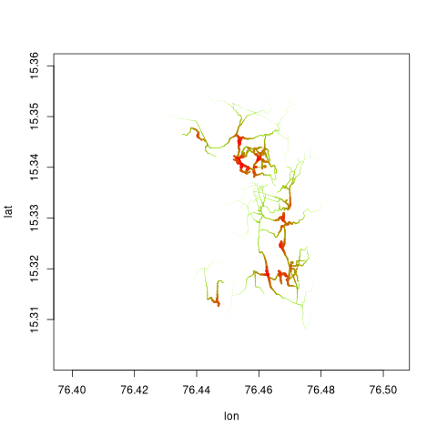
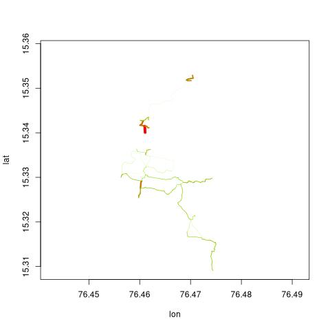
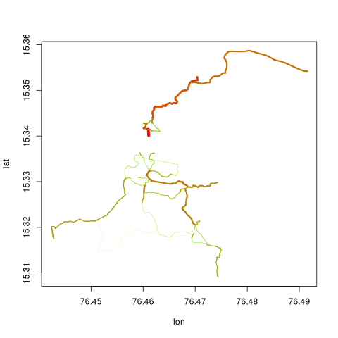

# dodgr flows

The `dodgr`package includes three functions for allocating and
aggregating flows throughout network, based on defined properties of a
set of origin and destination points. The three primary functions for
flows are
[`dodgr_flows_aggregate()`](https://UrbanAnalyst.github.io/dodgr/reference/dodgr_flows_aggregate.html),
[`dodgr_flows_disperse()`](https://UrbanAnalyst.github.io/dodgr/reference/dodgr_flows_disperse.html),
and
[`dodgr_flows_si()`](https://UrbanAnalyst.github.io/dodgr/reference/dodgr_flows_si.html),
each of which is now described in detail.

## 1 Flow Aggregation

The first of the above functions aggregates ‘’flows’’ throughout a
network from a set of origin (`from`) and destination (`to`) points.
Flows commonly arise in origin-destination matrices used in transport
studies, but may be any kind of generic flows on graphs. A flow matrix
specifies the flow between each pair of origin and destination points,
and the
[`dodgr_flows_aggregate()`](https://UrbanAnalyst.github.io/dodgr/reference/dodgr_flows_aggregate.html)
function aggregates all of these flows throughout a network and assigns
a resultant aggregate flow to each edge.

For a set of `nf` points of origin and `nt` points of destination, flows
are defined by a simple `nf`-by-`nt` matrix of values, as in the
following code:

``` r
graph <- weight_streetnet (hampi, wt_profile = "foot")
set.seed (1)
from <- sample (graph$from_id, size = 10)
to <- sample (graph$to_id, size = 10)
flows <- matrix (10 * runif (length (from) * length (to)),
    nrow = length (from)
)
```

This `flows` matrix is then submitted to
[`dodgr_flows_aggregate()`](https://UrbanAnalyst.github.io/dodgr/reference/dodgr_flows_aggregate.html),
which simply appends an additional column of `flows` to the submitted
`graph`:

``` r
graph_f <- dodgr_flows_aggregate (graph, from = from, to = to, flows = flows)
head (graph_f)
```

    ##   geom_num edge_id    from_id from_lon from_lat      to_id   to_lon   to_lat
    ## 1        1       1  339318500 76.47491 15.34167  339318502 76.47612 15.34173
    ## 2        1       2  339318502 76.47612 15.34173  339318500 76.47491 15.34167
    ## 3        1       3  339318502 76.47612 15.34173 2398958028 76.47621 15.34174
    ## 4        1       4 2398958028 76.47621 15.34174  339318502 76.47612 15.34173
    ## 5        1       5 2398958028 76.47621 15.34174 1427116077 76.47628 15.34179
    ## 6        1       6 1427116077 76.47628 15.34179 2398958028 76.47621 15.34174
    ##            d d_weighted highway   way_id component      time time_weighted flow
    ## 1 129.761207 129.761207    path 28565950         1 93.428069     93.428069    0
    ## 2 129.761207 129.761207    path 28565950         1 93.428069     93.428069    0
    ## 3   8.874244   8.874244    path 28565950         1  6.389455      6.389455    0
    ## 4   8.874244   8.874244    path 28565950         1  6.389455      6.389455    0
    ## 5   9.311222   9.311222    path 28565950         1  6.704080      6.704080    0
    ## 6   9.311222   9.311222    path 28565950         1  6.704080      6.704080    0

Most flows are zero because they have only been calculated between very
few points in the graph.

``` r
summary (graph_f$flow)
```

    ##    Min. 1st Qu.  Median    Mean 3rd Qu.    Max. 
    ##  0.0000  0.0000  0.0000  0.3164  0.0000  5.1291

## 2 Flow Dispersal

The second function,
[`dodgr_flows_disperse()`](https://UrbanAnalyst.github.io/dodgr/reference/dodgr_flows_disperse.html),
uses only a vector a origin (`from`) points, and aggregates flows as
they disperse throughout the network according to a simple exponential
model. In place of the matrix of flows required by
[`dodgr_flows_aggregate()`](https://UrbanAnalyst.github.io/dodgr/reference/dodgr_flows_aggregate.html),
dispersal requires an equivalent vector of densities dispersing from all
origin (`from`) points. This is illustrated in the following code, using
the same graph as the previous example.

``` r
dens <- rep (1, length (from)) # uniform densities
graph_f <- dodgr_flows_disperse (graph, from = from, dens = dens)
summary (graph_f$flow)
```

    ##      Min.   1st Qu.    Median      Mean   3rd Qu.      Max. 
    ## 0.000e+00 0.000e+00 7.549e-05 8.658e-03 1.010e-02 1.587e-01

## 3 Merging directed flows

Note that flows from both
[`dodgr_flows_aggregate()`](https://UrbanAnalyst.github.io/dodgr/reference/dodgr_flows_aggregate.html)
and
[`dodgr_flows_disperse()`](https://UrbanAnalyst.github.io/dodgr/reference/dodgr_flows_aggregate.html)
are *directed*, so the flow from ‘A’ to ‘B’ will not necessarily equal
the flow from ‘B’ to ‘A’. It is often desirable to aggregate flows in an
undirected manner, for example for visualisations where plotting pairs
of directed flows between each edge if often not feasible for large
graphs. Directed flows can be aggregated to equivalent undirected flows
with the
[`merge_directed_graph()`](https://UrbanAnalyst.github.io/dodgr/reference/merge_directed_graph.md)
function:

``` r
graph_undir <- merge_directed_graph (graph_f)
```

Resultant graphs produced by
[`merge_directed_graph()`](https://UrbanAnalyst.github.io/dodgr/reference/merge_directed_graph.html)
only include those edges having non-zero flows, and so:

``` r
nrow (graph_f)
```

    ## [1] 6813

``` r
nrow (graph_undir) # the latter is much smaller
```

    ## [1] 3069

The resultant graph can readily be merged with the original graph to
regain the original data on vertex coordinates through

``` r
graph <- graph [graph_undir$edge_id, ]
graph$flow <- graph_undir$flow
```

This graph may then be used to visualise flows with the
[`dodgr_flowmap()`](https://UrbanAnalyst.github.io/dodgr/reference/dodgr_flowmap.html)
function:

``` r
graph_f <- graph_f [graph_f$flow > 0, ]
dodgr_flowmap (graph_f, linescale = 5)
```



## 4. Flows from spatial interaction models

An additional function,
[`dodgr_flows_si()`](https://UrbanAnalyst.github.io/dodgr/reference/dodgr_flows_si.html)
enables flows to be aggregated according to exponential spatial
interaction models. The function is called just as the
[`dodgr_flows_aggregate()`](https://UrbanAnalyst.github.io/dodgr/reference/dodgr_flows_aggregate.md)
call demonstrated above, but without the `flows` matrix specifying
strengths of flows between each pair of points.

``` r
graph_f <- dodgr_flows_si (graph, from = from, to = to)
graph_undir <- merge_directed_graph (graph_f)
graph <- graph [graph_undir$edge_id, ]
graph$flow <- graph_undir$flow
graph_f <- graph_f [graph_f$flow > 0, ]
dodgr_flowmap (graph_f, linescale = 5)
```



Flows in that graph are are notably lower than in the previous one,
because that previous one aggregated flows between all pairs of points
with no attenuation. Spatial interaction models attenuate both
attraction based on how far apart two points are, as well as flows along
paths between those points based on an exponential decay model. The
documentation for that function describes the several ways this
attenuation can be controlled, the easiest of which is via a single
numeric value. Reducing the attenuation gives the following result:

``` r
graph <- weight_streetnet (hampi, wt_profile = "foot")
graph_f <- dodgr_flows_si (graph, from = from, to = to, k = 1e6)
graph_undir <- merge_directed_graph (graph_f)
graph <- graph [graph_undir$edge_id, ]
graph$flow <- graph_undir$flow
graph_f <- graph_f [graph_f$flow > 0, ]
dodgr_flowmap (graph_f, linescale = 5)
```


