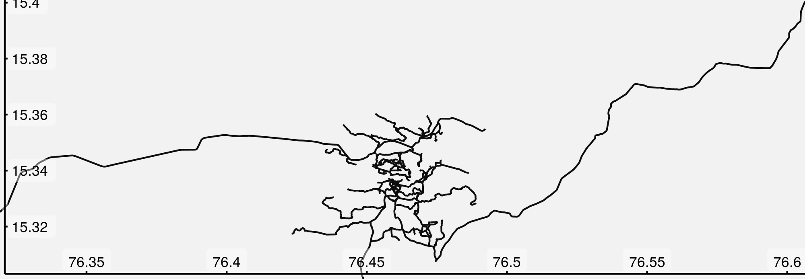

```{r pkg-load, echo = FALSE, message = FALSE}
devtools::load_all (".", export_all = FALSE)
```

# 1 Background: Directed Graphs

`dodgr` is an **R** package for calculating **D**istances **O**n **D**irected
**Gr**aphs. It does so very efficiently, and is able to process larger graphs
than many other comparable **R** packages. Skip straight to the Intro if you
know what directed graphs are (but maybe make a brief stop-in to Dual-Weighted
Directed Graphs below.) Directed graphs are ones in which the "distance" (or
some equivalent measure) from A to B is not necessarily equal to that from B to
A. In Fig. 1, for example, the weights between the graph vertices (A, B, C, and
D) differ depending on the direction of travel, and it is only possible to
traverse the entire graph in an anti-clockwise direction.

```{r fig1, fig.align="center", echo=FALSE, engine='tikz',fig.ext='svg', code=readLines("fig1.tex"), fig.cap="Figure 1: A weighted, directed graph"}
```

Graphs in `dodgr` are represented by simple flat `data.frame` objects, so the
graph of Fig. 1, presuming the edge weights to take values of 1, 2, and 3, would
be,
```{r sample-graph1, echo = FALSE}
graph <- data.frame (from = c ("A", "B", "B", "B", "C", "C", "D", "D"),
                     to = c ("B", "A", "C", "D", "B", "D", "C", "A"),
                     d = c (1, 2, 1, 3, 2, 1, 2, 1))
graph
```
The primary function of `dodgr` is `dodgr_dists`, which calculates pair-wise
shortest distances between all vertices of a graph.
```{r sample-dists1}
dodgr_dists (graph)
dodgr_dists (graph, from = c ("A", "C"), to = c ("B", "C", "D"))
```


## 1.1 Dual-Weighted Directed Graphs

Shortest-path distances on weighted graphs can be calculated using a number of
other **R** packages, such as
[`igraph`](https://cran.r-project.org/package=igraph) or
[`e1071`](https://cran.r-project.org/package=e1071). `dodgr` comes into its own
through its ability to trace paths through *dual-weighted* directed graphs,
illustrated in Fig. 2.

```{r fig2, fig.align="center", echo=FALSE, engine='tikz',fig.ext='svg', code=readLines("fig2.tex"), fig.cap="Figure 2: A **dual**-weighted, directed graph in which the weights (represented by thicknesses) of the grey arrows differ from those of the black arrows."}
```
Dual-weighted directed graphs are common in many areas, a foremost example
being routing through street networks. Routes through street networks depends on
mode of transport: the route a pedestrian might take will generally differ
markedly from the route the same person might take if behind the wheel of an
automobile. Routing through street networks thus generally requires each edge to
be specified with two weights or distances: one quantifying the physical
distance, and a second weighted version reflecting the mode of transport (or
some other preferential weighting).

`dodgr` calculates shortest paths using one set of weights (called "weights" or
anything else starting with "w"), but returns the actual lengths of them using a
second set of weights (called "distances", or anything else starting with "d").
If no weights are specified, distances alone are used both for routing and final
distance calculations.  Consider that the weights and distances of Fig. 2 are
the black and grey lines, respectively, with the latter all equal to one. In
this case, the graph and associated shortest distances are,
```{r sample-graph2, echo = FALSE}
graph <- data.frame (from = c ("A", "B", "B", "B", "C", "C", "D", "D"),
                     to = c ("B", "A", "C", "D", "B", "D", "C", "A"),
                     w = c (1, 2, 1, 3, 2, 1, 2, 1),
                     d = c (1, 1, 1, 1, 1, 1, 1, 1))
graph
dodgr_dists (graph)
```
Note that even though the shortest "distance" from A to D is actually
A$\to$B$\to$D with a distance of only 2, that path has a weighted distance of
1 + 3 = 4. The shortest *weighted* path is A$\to$B$\to$C$\to$D, with a distance
both weighted and unweighted of 1 + 1 + 1 = 3. Thus `d(A,D) = 3` and not 2.

# 2 Introduction to `dodgr` 

Although the package has been intentionally developed to be adaptable to any
kinds of networks, most of the applications illustrated here concern street
networks, and also illustrate several helper functions the package offers for
working with street networks. The basic `graph` object of `dodgr` is
nevertheless arbitrary, and need only minimally contain three or four columns as
demonstrated in the simple examples at the outset.

The package may be used to calculate a matrix of distances between a given set
of geographic coordinates. We can start by simply generating some random
coordinates, in this case within the bounding box defining the city of York in
the U.K.
```{r get-york-data, eval = FALSE}
bb <- osmdata::getbb ("york uk")
npts <- 1000
xy <- apply (bb, 1, function (i) min (i) + runif (npts) * diff (i))
bb; head (xy)
```
```{r york-bb, echo = FALSE}
bb <- rbind (c (-1.241536, -0.9215361), c (53.799056, 54.1190555))
rownames (bb) <- c ("x", "y")
colnames (bb) <- c ("min", "max")
bb
x <- c (-1.1713502, -1.2216108, -1.0457199, -0.9384666, -0.9445541, -1.1207099)
y <- c (53.89409, 54.01065, 53.83613, 53.93545, 53.89436, 54.01262)
cbind (x, y)
```
Those points can simply be passed to `dodgr_dists()`:
```{r dodgr-dists-in-york, eval = FALSE}
system.time(
            d <- dodgr_dists (from = xy, to = xy,
                              wt_profile = "foot", quiet = FALSE)
            )
```
```{r dists-york-message, echo = FALSE}
message (paste0 ("No graph submitted to dodgr_dists; ",
                 "downloading street network ... done\n",
                 "Converting network to dodgr graph ... done\n",
                 "Calculating shortest paths ... done"))
```
```{r dists-york-time, echo = FALSE}
st <- system.time (Sys.sleep (0.1))
st [1] <- 26.620
st [2] <- 0.132
st [3] <- 28.567
st
```
```{r dists-york-structure, eval = FALSE}
dim (d); range (d, na.rm = TRUE)
```
```{r dists-york-output, echo = FALSE}
c (1000, 1000)
c (0.00000, 46.60609)
```
The result is a matrix of 1000-by-1000 distances of up to 47km long, measured
along routes weighted for optimal pedestrian travel. In this case, the single
call to `dodgr_dists()` automatically downloaded the entire street network of York
and calculated one million shortest-path distances, all in under 30 seconds.


# 3 Graphs and Street Networks

Although the above code is short and fast, most users will probably want more
control over their graphs and routing possibilities. Each of the steps indicated
above (through the `quiet = FALSE` option) can be implemented separately. To
illustrate, the remainder of this vignette analyses the much smaller street
network of Hampi, Karnataka, India, included in the `dodgr` package as the
dataset `hampi`. This data set may be re-created with the following single line:
```{r get-hampi-code, eval = FALSE}
hampi <- dodgr_streetnet ("hampi india")
```
Or with the equivalent version bundled with the package:
```{r hampi-call}
class (hampi)
```
```{r hampi-geom-class}
class (hampi$geometry)
```
```{r hampi-dim}
dim (hampi)
```
The `streetnet` is an [`sf`](https://cran.r-project.org/package=sf) (Simple
Features) object containing 189 `LINESTRING` geometries. In other words, it's
got an `sf` representation of 189 street segments. The **R** package `osmplotr`
can be used to visualise this street network (with the help of `magrittr` pipe
operator, `%>%`):
```{r hampi-osmplotr, eval = FALSE}
library (osmplotr)
library (magrittr)
map <- osm_basemap (hampi, bg = "gray95") %>%
    add_osm_objects (hampi, col = "gray5") %>%
    add_axes () %>%
    print_osm_map ()
```
```{r load-magritr, echo = FALSE, message = FALSE}
library (magrittr)
```
```{r hampi-osmplotr-to-file, echo = FALSE, eval = FALSE}
map <- osm_basemap (hampi, bg = "gray95") %>%
    add_osm_objects (hampi, col = "gray5") %>%
    add_axes () %>%
    print_osm_map (filename = "hampi.png", width = 2000, units = "px")
```


(Note that this requires current `dev` version of `osmplotr`, which can be
installed with `devtools::install_github ("ropensci/osmplotr")`.)

The `sf` class data representing the street network of Hampi can then be
converted into a flat `data.frame` object by
```{r hampi-weight_streetnet}
graph <- weight_streetnet (hampi, wt_profile = "foot")
dim (graph)
```
```{r hampi-head}
head (graph)
```
Note that the actual graph contains around 30 times as many edges as there are
streets, indicating that each street is composed on average of around 30
individual segments.  The individual points points or vertices from those
segments can be extracted with,
```{r hampi-verts}
vt <- dodgr_vertices (graph)
head(vt)
```
```{r hampi-verts-out}
dim (vt)
```
From which we see that the OpenStreetMap representation of the streets of Hampi
has 189 line segments with 2,987 unique points and 6,096 edges between those
points.  The number of edges per vertex in the entire network is thus,
```{r hampi-edge2vert}
nrow (graph) / nrow (vt)
```
A simple straight line has two edges between all intermediate nodes, and this
thus indicates that the network in it's entirety is quite simple. The
`data.frame` resulting from `weight_streetnet()` is what `dodgr` uses to
calculate shortest path routes, as will be described below, following a brief
description of weighting street networks.


## 3.1 Graph Components

The foregoing `graph` object returned from `weight_streetnet()` also includes a
`$component` column enumerating all of the distinct inter-connected components of
the graph.
```{r hampi-components}
table (graph$component)
```
Components are numbered in order of decreasing size, with `$component = 1`
always denoting the largest component. In this case, that component contains
3,934 edges, representing 65% of the graph. There are clearly only three distinct
components, but this number may be much larger for larger graphs, and may be
obtained from,
```{r hampi-num-components}
length (unique (graph$component))
```
Component numbers can be determined for any types of graph with the
`dodgr_components()` function. For example, the following lines reduce the
previous graph to a minimal (non-spatial) structure of four columns, and then
(re-)calculate a fifth column of `$component`s:
```{r hampi-graph-min}
cols <- c ("edge_id", "from_id", "to_id", "d")
graph_min <- graph [, which (names (graph) %in% cols)]
graph_min <- dodgr_components (graph_min)
head (graph_min)
```
The `component` column column can be used to select or filter any component in
a graph.  It is particularly useful to ensure routing calculations consider only
connected vertices through simply removing all minor components:
```{r hampi-connected}
graph_connected <- graph [graph$component == 1, ]
```
This is explored further below (under Distance Matrices).

## 3.2 Weighting Profiles

Dual-weights for street networks are generally obtained by multiplying the
distance of each segment by a weighting factor reflecting the type of highway.
As demonstrated above, this can be done easily within `dodgr` with the
`weight_streetnet()` function, which applies the named weighting profiles included
with the `dodgr` package to OpenStreetMap networks extracted with the
[`osmdata`](https://cran.r-project.org/package=osmdata) package. Each profile
assigns weights to each distinct type of highway.
```{r weighting-profiles}
names (weighting_profiles)
class (weighting_profiles)
unique (weighting_profiles$name)
weighting_profiles [weighting_profiles$name == "foot", ]
```
Each profile is defined by a series of percentage weights quantifying
highway-type preferences for a particular mode of travel.  The distinct types of
highways within the Hampi graph obtained above can be tabulated with:
```{r hampi-highway-types}
table (graph$highway)
```
Hampi is unlike most other human settlements on the planet in being a Unesco
World Heritage area in which automobiles are generally prohibited. Accordingly,
numbers of `"footway"`, `"path"`, and `"pedestrian"` ways far exceed typical
categories denoting automobile traffic (`"primary", "residential", "tertiary"`)

It is also possible to use other types of (non-OpenStreetMap) street networks,
an example of which is the `os_roads_bristol` data provided with the package.
"OS" is the U.K. Ordnance Survey, and these data are provided as a Simple
Features ([`sf`](https://cran.r-project.org/package=sf)) `data.frame` with a
decidedly different structure to `osmdata data.frame` objects:
```{r hampi-bristol-comp}
names (hampi) # many fields manually removed to reduce size of this object
names (os_roads_bristol)
```
The latter may be converted to a `dodgr` network by first specifying a weighting
profile, here based on the `formOfWay` column:
```{r wt-bristol}
colnm <- "formOfWay"
table (os_roads_bristol [[colnm]])
wts <- c (0.1, 0.2, 0.8, 1)
names (wts) <- unique (os_roads_bristol [[colnm]])
net <- weight_streetnet (os_roads_bristol, wt_profile = wts,
                         type_col = colnm, id_col = "identifier")
```
The resultant `net` object contains the street network of `os_roads_bristol`
weighted by the specified profile, and in a format suitable for submission to
any `dodgr` routine.

## 3.3 Random Sub-Graphs

The `dodgr` packages includes a function to select a random connected portion of
graph including a specified number of vertices. This function is used in the
`compare_heaps()` function described below, but is also useful for general
statistical analyses of large graphs which may otherwise take too long to
compute.
```{r dodgr-sample}
graph_sub <- dodgr_sample (graph, nverts = 100)
nrow (graph_sub)
```
The random sample has around twice as many edges as vertices, in accordance with
the statistics calculated above.
```{r dodgr-sample-verts}
nrow (dodgr_vertices (graph_sub))
```

# 4 Distance Matrices: `dodgr_dists()`

As demonstrated at the outset, an entire network can simply be submitted to
`dodgr_dists()`, in which case a square matrix will be returned containing
pair-wise distances between all vertices. Doing that for the `graph` of York
will return a square matrix of around 90,000-times-90,000 (or 8
billion) distances. It might be possible to do that on some computers, but is
possibly neither recommended nor desirable.  The `dodgr_dists()` function
accepts additional arguments of `from` and `to` defining points from and to
which distances are to be calculated. If only `from` is provided, a square
matrix is returned of pair-wise distances between all listed points.

## 4.1 Aligning Routing Points to Graphs

For spatial graphs---that is, those containing columns of latitudes and
longitudes (or "x" and "y")---routing points can be represented by a simple
matrix of arbitrary latitudes and longitudes (or, again, "x" and "y").
`dodgr_dists()` will map these points to the closest network points, and return
corresponding shortest-path distances. This may be illustrated by generating
random points within the bounding box of the above map of Hampi. As demonstrated
above, the coordinates of all vertices may be extracted with the
`dodgr_vertices()` function, enabling random points to be generated with the
following lines:
```{r verts-to-points}
vt <- dodgr_vertices (graph)
n <- 100 # number of points to generate
xy <- data.frame (x = min (vt$x) + runif (n) * diff (range (vt$x)),
                  y = min (vt$y) + runif (n) * diff (range (vt$y)))
```
Submitting these to `dodgr_dists()` as points **from** which to route will
generate a distance matrix from each of these 100 points to every other point in
the graph:
```{r dodogr-dists-structure}
d <- dodgr_dists (graph, from = xy)
dim (d); range (d, na.rm = TRUE)
```
If the `to` argument is also specified, the matrix returned will have rows
matching `from` and columns matching `to`
```{r dodogr-dists-structure2}
d <- dodgr_dists (graph, from = xy, to = xy [1:10, ])
dim (d)
```
Some of the resultant distances in the above cases are `NA` because the points
were sampled from the entire bounding box, and the street network near the
boundaries may be cut off from the rest. As demonstrated above, the
`weight_streetnet()` function returns a `component` vector, and such
disconnected edges will have `graph$component > 1`, because `graph$component ==
1` always denotes the largest connected component.  This means that the graph
can always be reduced to the single largest component with the following single
line:
```{r main-component}
graph_connected <- graph [graph$component == 1, ]
```
A distance matrix obtained from running `dodgr_dists` on `graph_connected`
should generally contain no `NA` values, although some points may still be
effectively unreachable due to one-way connections (or streets). Thus, routing
on the largest connected component of a directed graph ought to be expected to
yield the *minimal* number of `NA` values, which may sometimes be more than
zero. Note further that spatial routing points (expressed as `from` and/or `to`
arguments) will in this case be mapped to the nearest vertices of
`graph_connected`, rather than the potentially closer nearest points of the full
`graph`. This may make the spatial mapping of routing points less accurate than
results obtained by repeating extraction of the street network using an expanded
bounding box. For automatic extraction of street networks with `dodgr_dists()`,
the extent by which the bounding box exceeds the range of routing points (`from`
and `to` arguments) is determined by an extra parameter `expand`, quantifying
the relative extent to which the bounding box should exceed the spatial range of
the routing points. This is illustrated in the following code which calculates
distances between 100 random points:
```{r york-streetnet, eval = FALSE}
bb <- osmdata::getbb ("york uk")
npts <- 100
xy <- apply (bb, 1, function (i) min (i) + runif (npts) * diff (i))
routed_points <- function (expand = 0, pts)
{
    gr0 <- dodgr_streetnet (pts = pts, expand = expand) %>%
        weight_streetnet ()
    d0 <- dodgr_dists (gr0, from = pts)
    length (which (is.na (d0))) / length (d0)
}
```
```{r york-streetnet-output, eval = FALSE}
vapply (c (0, 0.05, 0.1), function (i) routed_points (i, pts = xy),
        numeric (1))
```
```{r york-streetntet-values, echo = FALSE}
c (0.078, 0.0586, 0)
```
With a street network that precisely encompasses the submitted routing points
(`expand = 0`), 7.8% of pairwise distances are unable to be calculated; with a
bounding box expanded to 5% larger than the submitted points, this is reduced to
5.9%, and with expansion to 10%, all points can be connected.

For non-spatial graphs, `from` and `to` must match precisely on to vertices
named in the graph itself. In the graph considered above, these vertex names
were contained in the columns, `from_id` and `to_id`. The minimum that a `dodgr`
graph requires is,
```{r york-streetnet-graph-head}
head (graph [, names (graph) %in% c ("from_id", "to_id", "d")])
```
in which case the `from` values submitted to `dodgr_dists()` (and `to`, if
given) must directly name the vertices in the `from_id` and `to_id` columns of
the graph. This is illustrated in the following code:
```{r york-streetnet-graph-strucutre}
graph_min <- graph [, names (graph) %in% c ("from_id", "to_id", "d")]
fr <- sample (graph_min$from_id, size = 10) # 10 random points
to <- sample (graph_min$to_id, size = 20)
d <- dodgr_dists (graph_min, from = fr, to = to)
dim (d)
```
The result is a 10-by-20 matrix of distances between these named graph vertices.

## 4.2 Shortest Path Calculations: Priority Queues

`dodgr` uses an internal library [@Saunders2003, @Saunders2004] for the calculation of shortest paths using a
variety of priority queues [see @Miller1960 for an overview].  In the context of
shortest paths, priority queues determine the order in which a graph is
traversed [@Tarjan1983], and the choice of priority queue can have a
considerable effect on computational efficiency for different kinds of graphs
[@Johnson1977].  In contrast to `dodgr`, most other **R** packages for shortest
path calculations do not use priority queues, and so may often be less
efficient. Shortest path distances can be calculated in `dodgr` with priority
queues that use the following heaps:

1. Binary heaps;
2. Fibonacci heaps [@Fredman1987];
3. Trinomial and extended trinomial heaps [@Takaoka2000]; and
4. 2-3 heaps [@Takaoka1999].

Differences in how these heaps operate are often largely extraneous to direct
application of routing algorithms, even though heap choice may strongly affect
performance. To avoid users needing to know anything about algorithmic details,
`dodgr` provides a function `compare_heaps` to which a particular graph may be
submitted in order to determine the optimal kind of heap. 

The comparisons are actually made on a randomly selected sub-component of the
graph containing a defined number of vertices (with a default of 1,000, or the
entire graph if it contains fewer than 1,000 vertices).
```{r compare-heaps}
compare_heaps (graph, nverts = 100, replications = 1)
```
The key column of that `data.frame` is `relative`, which quantifies the relative
performance of each test in relation to the best which is given a score of 1.
`dodgr` using the default `heap = "BHeap"`, which is a binary heap priority
queue, performs faster than `igraph` [@Csardi2006] for these graphs. Different
kind of graphs will perform differently with different priority queue
structures, and this function enables users to empirically discern the optimal
heap for their kind of graph.

Note, however, that this is not an entirely fair comparison, because `dodgr`
calculates dual-weighted distances, whereas `igraph`---and indeed all other
**R** packages---only directly calculate distances based on a single set of
weights. Implementing dual-weighted routing in these cases requires explicitly
re-tracing all paths and summing the second set of weights along each path. A
time comparison in that case would be very strongly in favour of `dodgr`.
Moreover, `dodgr` can convert graphs to contracted form through removing
redundant vertices, as detailed in the following section. Doing so greatly
improves performance with respect to `igraph`.

For those wishing to do explicit comparisons themselves, the following code
generates the `igraph` equivalent of `dodgr_dists()`, although of course for
single-weighted graphs only:
```{r graph-code, eval = FALSE}
edges <- cbind (graph$from_id, graph$to_id)
pts <- sample (unique (as.vector (edges)), 100) # set of random routing points
edges <- as.vector (t (edges))
igr <- igraph::make_directed_graph (edges)
igraph::E (igr)$weight <- graph$d
d <- igraph::distances (igr, v = pts, to = pts, mode = "out")
```


# 5 Graph Contraction

A further unique feature of `dodgr` is the ability to remove redundant vertices
from graphs (see Fig. 3), thereby speeding up routing calculations.

```{r fig3, fig.align="center", echo=FALSE, engine='tikz',fig.ext='svg', code=readLines("fig3.tex"), fig.cap="Figure 3: **(A)** Vertex#2 is redundant for routing calculations from anywhere other than that point itself. (**B**) Equivalent graph to (**A**) contracted through removal of vertex#2. (**C**) Vertex#2 is not redundant."}
```

In Fig. 3(A), the only way to get from vertex 1 to 3, 4 or 5 is through C. The
intermediate vertex B is redundant for routing purposes (and than to or from
that precise point) and may simply be removed, with directional edges inserted
directly between vertices 1 and 3. This yields the equivalent contracted graph
of Fig. 3(B), in which, for example, the distance (or weight) between 1 and 3 is
the sum of previous distances (or weights) between 1 $\to$ 2 and 2 $\to$ 3. Note
that if one of the two edges between, say, 3 and 2 were removed, vertex 2 would
no longer be redundant (Fig.  3(C)).

Different kinds of graphs have different degrees of redundancy, and even street
networks differ, through for example dense inner-urban networks generally being
less redundant than less dense extra-urban or rural networks. The contracted
version of a graph can be obtained with the function `dodgr_compact_graph()`,
illustrated here with the York example from above.
```{r contract-graph}
grc <- dodgr_contract_graph (graph)$graph
```
The function `dodgr_compact_graph()` returns a list with the compact graph and a
table relating the contracted edges to the corresponding original edges in the
full graph. Relative sizes are
```{r contract-graph-structure}
nrow (graph); nrow (grc); nrow (grc) / nrow (graph)
```
equivalent to the removal of around 90% of all edges.  The difference in routing
efficiency can then be seen with the following code
```{r benchmark1}
from <- sample (grc$from_id, size = 100)
to <- sample (grc$to_id, size = 100)
rbenchmark::benchmark (
                       d2 <- dodgr_dists (grc, from = from, to = to),
                       d2 <- dodgr_dists (graph, from = from, to = to),
                       replications = 2)
```
And contracting the graph has a similar effect of speeding up pairwise routing
between these 100 points.  All routing algorithms scale non-linearly with size,
and relative improvements in efficiency will be even greater for larger graphs. 

## 5.1 Routing on Contracted Graphs

Routing is often desired between defined points, and these points may
inadvertently be removed in graph contraction. The `dodgr_contract_graph()`
function accepts an additional argument specifying vertices to keep within the
contracted graph. This list of vertices must directly match the vertex ID values
in the graph.

The following code illustrates how to retain specific vertices within contracted
graphs:
```{r contracted-with-verts}
grc <- dodgr_contract_graph (graph)$graph
nrow (grc)
verts <- sample (dodgr_vertices (graph)$id, size = 100)
head (verts) # a character vector
grc <- dodgr_contract_graph (graph, verts)$graph
nrow (grc)
```
Retaining the nominated vertices yields a graph with considerably more edges
than the fully contracted graph excluding these vertices. The `dodgr_dists()`
function can be applied to the latter graph to obtain accurate distances
precisely routed between these points, yet using the speed advantages of graph
contraction.

# 6 Shortest Paths

Shortest paths can also be extracted with the `dodgr_paths()` function. For
given vectors of `from` and `to` points, this returns a nested list so that if,
```{r}
dp <- dodgr_paths (graph, from = from, to = to)
```
then `dp [[i]] [[j]]` will contain the path from `from [i]` to `to [j]`. The
paths are represented as sequences of vertex names. Consider the following
example,
```{r}
graph <- weight_streetnet (hampi)
head (graph)
```
The columns of `from_id` and `to_id` contain the names of the vertices. To
extract shortest paths between some of these, first take some small samples of
`from` and `to` points, and submit them to `dodgr_paths()`:
```{r}
from <- sample (graph$from_id, size = 10)
to <- sample (graph$to_id, size = 5)
dp <- dodgr_paths (graph, from = from, to = to)
length (dp)
```
The result (`dp`) is a list of 10 items, each of which contains 5 vectors. An
example is,
```{r, eval = FALSE}
dp [[1]] [[1]]
```
```{r, echo = FALSE}
# make sure there are some paths:
maxlen <- max (unlist (lapply (dp, function (i)
                               max (unlist (lapply (i, length))))))
if (maxlen > 0)
{
    n <- 0
    i <- 0
    while (all (n == 0))
    {
        i <- i + 1
        n <- which (lapply (dp [[i]], length) > 0)
    }
    j <- n [1]
    dp [[i]] [[j]]
}
```
For spatial graphs, the coordinates of these paths can be obtained by extracting
the vertices with `dodgr_vertices()` and matching the vertex IDs:
```{r, eval = FALSE}
verts <- dodgr_vertices (graph)
path1 <- verts [match (dp [[1]] [[1]], verts$id), ]
head (path1)
```
```{r, echo = FALSE}
verts <- dodgr_vertices (graph)
path1 <- verts [match (dp [[i]] [[j]], verts$id), ]
head (path1)
```
Paths calculated on contracted graphs will of course have fewer vertices than
those calculated on full graphs.

# 7 Aggregated Flows

The final major functions of `dodgr` are `dodgr_flows_aggregate()` and
`dodgr_flows_disperse()`.

## 7.1 Direct Aggregation

The former of the above functions aggregates ''flows'' throughout a
network from a set of origin (`from`) and destination (`to`) points.  Flows
commonly arise in origin-destination matrices used in transport studies, but may
be any kind of generic flows on graphs. A flow matrix specifies the flow between
each pair of origin and destination points, and the `dodgr_flows_aggregate()`
function aggregates all of these flows throughout a network and assigns a
resultant aggregate flow to each edge.

For a set of `nf` points of origin and `nt` points of destination, flows are
defined by a simple `nf`-by-`nt` matrix of values, as in the following code:
```{r}
graph <- weight_streetnet (hampi)
from <- sample (graph$from_id, size = 10)
to <- sample (graph$to_id, size = 10)
flows <- matrix (10 * runif (length (from) * length (to)),
                 nrow = length (from))
```
This `flows` matrix is then submitted to `dodgr_flows_aggregate()`, which simply
appends an additional column of `flows` to the submitted `graph`:
```{r}
graph_f <- dodgr_flows_aggregate (graph, from = from, to = to, flows = flows)
head (graph_f)
```
Most flows are zero because they have only been calculated between very few
points in the graph.
```{r}
summary (graph_f$flow)
```

## 7.2 Flow Dispersal

The second function, `dodgr_flows_disperse()`, uses only a vector a origin
(`from`) points, and aggregates flows as they disperse throughout the network
according to a simple exponential model. In place of the matrix of flows
required by `dodgr_flows_aggregate()`, dispersal requires an equivalent vector
of densities dispersing from all origin (`from`) points. This is illustrated in
the following code, using the same graph as the previous example.
```{r}
dens <- rep (1, length (from)) # uniform densities
graph_f <- dodgr_flows_disperse (graph, from = from, dens = dens)
summary (graph_f$flow)
```

## 7.3 Merging directed flows

Note that flows from both `dodgr_flows_aggregate()` and `dodgr_flows_disperse()`
are *directed*, so the flow from 'A' to 'B' will not necessarily equal the flow
from 'B' to 'A'. It is often desirable to aggregate flows in an undirected
manner, for example for visualisations where plotting pairs of directed flows
between each edge if often not feasible for large graphs. Directed flows can be
aggregated to equivalent undirected flows with the `merge_directed_flows()`
function:
```{r}
graph_undir <- merge_directed_flows (graph_f)
```
Resultant graphs produced by `merge_directed_flows()` only include those edges
having non-zero flows, and so:
```{r}
nrow (graph_f); nrow (graph_undir) # the latter is much smaller
```
The resultant graph can readily be merged with the original graph to regain the
original data on vertex coordinates through
```{r}
graph <- graph [graph_undir$edge_id, ]
graph$flow <- graph_undir$flow
```
This graph may then be used to visalise flows with the `dodgr_flowmap` function:
```{r}
graph_f <- graph_f [graph_f$flow > 0, ]
dodgr_flowmap (graph_f, linescale = 5)
```


# Bibliography
