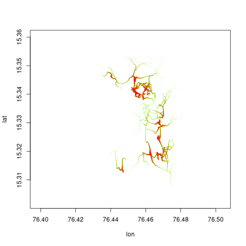
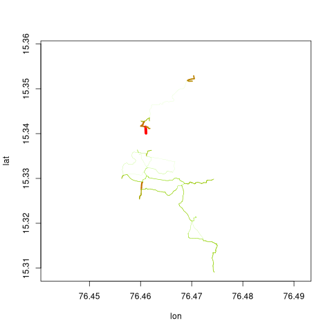
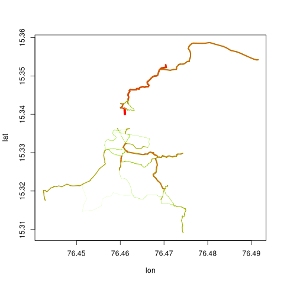

```{r pkg-load, echo = FALSE, message = FALSE}
library (dodgr)
```

The `dodgr`package includes three functions for allocating and aggregating
flows throughout network, based on defined properties of a set of origin and
destination points. The three primary functions for flows are
`dodgr_flows_aggregate()`,
`dodgr_flows_disperse()`,
and
`dodgr_flows_si()`,
each of which is now described in detail.

## 1 Flow Aggregation

The first of the above functions aggregates ''flows'' throughout a
network from a set of origin (`from`) and destination (`to`) points.  Flows
commonly arise in origin-destination matrices used in transport studies, but may
be any kind of generic flows on graphs. A flow matrix specifies the flow between
each pair of origin and destination points, and the
`dodgr_flows_aggregate()`
function aggregates all of these flows throughout a network and assigns a
resultant aggregate flow to each edge.

For a set of `nf` points of origin and `nt` points of destination, flows are
defined by a simple `nf`-by-`nt` matrix of values, as in the following code:
```{r}
graph <- weight_streetnet (hampi, wt_profile = "foot")
set.seed (1)
from <- sample (graph$from_id, size = 10)
to <- sample (graph$to_id, size = 10)
flows <- matrix (10 * runif (length (from) * length (to)),
    nrow = length (from)
)
```
This `flows` matrix is then submitted to
`dodgr_flows_aggregate()`,
which simply appends an additional column of `flows` to the submitted `graph`:
```{r}
graph_f <- dodgr_flows_aggregate (graph, from = from, to = to, flows = flows)
head (graph_f)
```
Most flows are zero because they have only been calculated between very few
points in the graph.
```{r}
summary (graph_f$flow)
```

## 2 Flow Dispersal

The second function,
`dodgr_flows_disperse()`,
uses only a vector a origin (`from`) points, and aggregates flows as they
disperse throughout the network
according to a simple exponential model. In place of the matrix of flows
required by
`dodgr_flows_aggregate()`,
dispersal requires an equivalent vector of densities dispersing from all origin
(`from`) points. This is illustrated in
the following code, using the same graph as the previous example.
```{r}
dens <- rep (1, length (from)) # uniform densities
graph_f <- dodgr_flows_disperse (graph, from = from, dens = dens)
summary (graph_f$flow)
```

## 3 Merging directed flows

Note that flows from both
`dodgr_flows_aggregate()`
and
`dodgr_flows_disperse()`
are *directed*, so the flow from 'A' to 'B' will not necessarily equal the flow
from 'B' to 'A'. It is often desirable to aggregate flows in an undirected
manner, for example for visualisations where plotting pairs of directed flows
between each edge if often not feasible for large graphs. Directed flows can be
aggregated to equivalent undirected flows with the `merge_directed_graph()`
function:
```{r}
graph_undir <- merge_directed_graph (graph_f)
```
Resultant graphs produced by
`merge_directed_graph()`
only include those edges having non-zero flows, and so:
```{r}
nrow (graph_f)
nrow (graph_undir) # the latter is much smaller
```
The resultant graph can readily be merged with the original graph to regain the
original data on vertex coordinates through
```{r}
graph <- graph [graph_undir$edge_id, ]
graph$flow <- graph_undir$flow
```
This graph may then be used to visualise flows with the
`dodgr_flowmap()`
function:
```{r flowmap, eval = FALSE}
graph_f <- graph_f [graph_f$flow > 0, ]
dodgr_flowmap (graph_f, linescale = 5)
```


## 4. Flows from spatial interaction models

An additional function,
`dodgr_flows_si()`
enables flows to be aggregated according to exponential spatial interaction
models. The function is called just as the `dodgr_flows_aggregate()` call
demonstrated above, but without the `flows` matrix specifying strengths of
flows between each pair of points.

```{r flows_si_map1-png, echo = FALSE, eval = FALSE}
graph_f <- dodgr_flows_si (graph, from = from, to = to)
graph_undir <- merge_directed_graph (graph_f)
graph <- graph [graph_undir$edge_id, ]
graph$flow <- graph_undir$flow
graph_f <- graph_f [graph_f$flow > 0, ]
png (file.path (here::here (), "vignettes", "hampi-flowmap2.png"),
    width = 480, height = 480, units = "px"
)
dodgr_flowmap (graph_f, linescale = 5)
dev.off (which = dev.cur ())
```
```{r flows_si_map1, eval = FALSE}
graph_f <- dodgr_flows_si (graph, from = from, to = to)
graph_undir <- merge_directed_graph (graph_f)
graph <- graph [graph_undir$edge_id, ]
graph$flow <- graph_undir$flow
graph_f <- graph_f [graph_f$flow > 0, ]
dodgr_flowmap (graph_f, linescale = 5)
```


Flows in that graph are are notably lower than in the previous one, because
that previous one aggregated flows between all pairs of points with no
attenuation. Spatial interaction models attenuate both attraction based on how
far apart two points are, as well as flows along paths between those points
based on an exponential decay model. The documentation for that function
describes the several ways this attenuation can be controlled, the easiest of
which is via a single numeric value. Reducing the attenuation gives the
following result:

```{r flows_si_map2-png, echo = FALSE, eval = FALSE}
graph <- weight_streetnet (hampi, wt_profile = "foot")
graph_f <- dodgr_flows_si (graph, from = from, to = to, k = 1e6)
graph_undir <- merge_directed_graph (graph_f)
graph <- graph [graph_undir$edge_id, ]
graph$flow <- graph_undir$flow
graph_f <- graph_f [graph_f$flow > 0, ]
png (file.path (here::here (), "vignettes", "hampi-flowmap3.png"),
    width = 480, height = 480, units = "px"
)
dodgr_flowmap (graph_f, linescale = 5)
dev.off (which = dev.cur ())
```
```{r flows_si_map2, eval = FALSE}
graph <- weight_streetnet (hampi, wt_profile = "foot")
graph_f <- dodgr_flows_si (graph, from = from, to = to, k = 1e6)
graph_undir <- merge_directed_graph (graph_f)
graph <- graph [graph_undir$edge_id, ]
graph$flow <- graph_undir$flow
graph_f <- graph_f [graph_f$flow > 0, ]
dodgr_flowmap (graph_f, linescale = 5)
```


## 5 Flows under optimal allocation

A final flow aggregation function,
`dodgr_flows_optalloc()`,
solves the transportation problem of allocating flows from a set of source
(`from`) points with associated densities to a set of capacity-limited target
(`to`) points, such that total flow from each source is fully allocated, no
target receives more than its capacity, and total allocation cost
(source-to-target network distance) is minimised. As with the previous
functions, the result is aggregated on to the network with
`dodgr_flows_aggregate()`, so this returns a graph with the usual additional
`flow` column.

Because targets may collectively have more capacity than sources have
density, `sum(source_densities) <= sum(target_capacities)` must hold. The
following code illustrates a typical call, again using the same `hampi`
network as above:
```{r}
graphc <- dodgr_contract_graph (graph)
set.seed (1)
from <- sample (graphc$from_id, size = 10)
to <- sample (graphc$to_id, size = 5)
to <- to [!to %in% from]
source_densities <- runif (length (from))
target_capacities <- runif (length (to))
# scale target_capacities to ensure sum(source_densities) <=
# sum(target_capacities):
target_capacities <- target_capacities *
    1.5 * sum (source_densities) / sum (target_capacities)
graph_f <- dodgr_flows_optalloc (
    graph,
    from = from,
    to = to,
    source_densities = source_densities,
    target_capacities = target_capacities
)
summary (graph_f$flow)
```
The `control` parameter determines how the underlying optimal allocation is
calculated, and must be a named list with an `algorithm` entry of either
`"sinkhorn"` (the default) or `"lp"`. The `"sinkhorn"` algorithm solves an
entropic-regularised approximation to the optimal allocation via iterative
matrix scaling, and is generally much faster for large numbers of
source/target points, at the cost of only approximating the true optimum.
The `"lp"` algorithm instead solves the exact transportation linear program
via the lpSolve package, which must be installed separately as it is only a
"Suggested", not "Imported", dependency:
```{r, eval = FALSE}
graph_f <- dodgr_flows_optalloc (
    graph,
    from = from,
    to = to,
    source_densities = source_densities,
    target_capacities = target_capacities,
    control = list (algorithm = "lp")
)
```
As with the other flow functions described above, the resultant directed
flows can be merged into a single undirected set of flows with
`merge_directed_graph()`,
and visualised with
`dodgr_flowmap()`:
```{r, eval = FALSE}
graph_undir <- merge_directed_graph (graph_f)
graph <- graph [graph_undir$edge_id, ]
graph$flow <- graph_undir$flow
graph_f <- graph_f [graph_f$flow > 0, ]
dodgr_flowmap (graph_f, linescale = 5)
```
