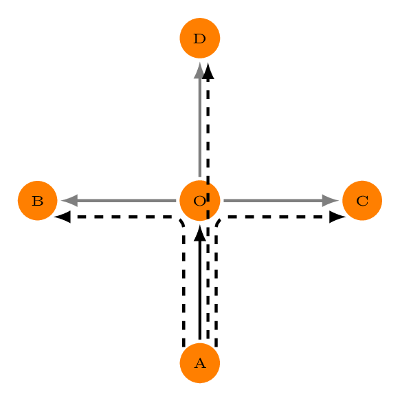

```{r pkg-load, echo = FALSE, message = FALSE}
library (dodgr)
```

# 1 Street Networks and Time-Based Routing

This vignette describes the use of the `dodgr` package for routing through
street networks, specifically for Open Street Map (OSM) networks extracted with
the [`osmdata` package](https://github.com/ropensci/osmdata), or via the `dodgr`
functions
[`dodgr_streetnet()`](https://atfutures.github.io/dodgr/reference/dodgr_streetnet.html)
and
[`dodgr_streetnet_sc()`](https://atfutures.github.io/dodgr/reference/dodgr_streetnet_sc.html).
Both of these functions use the [`osmdata`
package](https://github.com/ropensci/osmdata) package to extract networks from
Open Street Map, with the former returning data in [Simple Features
(`sf`)](https://cran.r-project.org/package=sf) format, and the latter in
[Silicate (`sc`)](https://github.com/hypertidy/silicate) format. The latter
format enables more detailed weighting, notably including the effects of turning
angles and elevation, as described below.

This vignette describes different approaches to weighting street networks for
routing based on either distances (shortest paths) or times (fastest paths). We
start by briefly describing the [Silicate
(`sc`)](https://github.com/hypertidy/silicate) format data returned by
[`dodgr_streetnet_sc()`](https://atfutures.github.io/dodgr/reference/dodgr_streetnet_sc.html),
including the ability to incorporate elevation data, before describing how to
use these data for different kinds of routing.

# 2. Silicate data and the `dodgr_streetnet_sc()` function

[Silicate (`sc`)](https://github.com/hypertidy/silicate) is a new format for
spatial data. Unlike almost all previous formats available in **R** for
representing and processing spatial data, which attempt to wrangle complex,
multidimensional data into a single, flat table, the
[Silicate (`sc`)](https://github.com/hypertidy/silicate) format is
multi-tabular. In its simplest form, it consists of three tables of vertices,
edges, and objects. The vertices are points, the edges are binary relationships
or connections between them, and the objects are high-order relationships or
assemblages of edges. The new [`osmdata`](https://github.com/ropensci/osmdata) function,
[`osmdata_sc()`](https://docs.ropensci.org/osmdata/reference/osmdata_sc.html)
extracts OSM data in [Silicate (`sc`)](https://github.com/hypertidy/silicate)
format, and returns seven tables plus an additional table of meta-data. The
`dodgr` functions may be directly used without understanding the format of these
data, but for those wishing to know, the tables are:

1. `nodes`, containing all OSM key-value data for nodes or vertices;
2. `relation_members` containing all membership information of OSM relations;
3. `relation_properties`, containing all key-value data for OSM relations;
4. `object`, containing all key-value data for OSM ways;
5. `object_link_edge`, connecting all `object` members to their constituent edges;
6. `edge`, a simple table of vertex pairs forming each edge; and
7. `vertex`, containing the coordinates and ID values of each OSM node, along
   with elevation data if provided.

Elevation data are used in time-based routing, and are particularly important
for modelling pedestrian and bicycle transport. The may be readily incorporated
with [Silicate (`sc`)](https://github.com/hypertidy/silicate) format data with
the new [`osmdata`](https://github.com/ropensci/osmdata) function,
[`osm_elevation()`](https://docs.ropensci.org/osmdata/reference/osm_elevation.html).
This function requires a locally-stored GeoTIFF-formatted elevation data file
to be downloaded from the [Consortium for Spatial
Information](https://srtm.csi.cgiar.org/srtmdata/), or any other source. These
data may then be appended by calling
[`osm_elevation()`](https://docs.ropensci.org/osmdata/reference/osm_elevation.html),
and specifying the name of this file. While time-based routing is possible with
[`sf`](https://cran.r-project.org/package=sf) format data, it is currently not
possible to incorporate elevation data with such data.

# 3. The `weight_streetnet()` function

The `dodgr` package represents all networks, including street networks, in flat,
tabular form in which each row represents a network edge. Spatial data derived
from OSM, either explicitly with the [`osmdata`
package](https://github.com/ropensci/osmdata), or through the `dodgr` helper
functions,
[`dodgr_streetnet()`](https://atfutures.github.io/dodgr/reference/dodgr_streetnet.html)
for [`sf`](https://cran.r-project.org/package=sf) or
[`dodgr_streetnet_sc()`](https://atfutures.github.io/dodgr/reference/dodgr_streetnet_sc.html)
for [`sc`](https://github.com/hypertidy/silicate) format data, may be directly
submitted to the `dodgr` function,
[`weight_streetnet()`](https://atfutures.github.io/dodgr/reference/weight_streetnet.html).
The two most important parameters in this function are:

1. `wt_profile`, a character string generally specifying a mode of transport
   (generally one of "bicycle", "foot", "goods", "hgv", "horse", "moped",
   "motorcar", "motorcycle", "psv", or "wheelchair"); and
2. `turn_penalty`, specifying whether edge times should include delays associated
   with turning across oncoming traffic, and whether turn restrictions should
   be obeyed.

The first of these options is described further in the following sub-section.
The second option has no effect for
[`sf`](https://cran.r-project.org/package=sf) data, but is particularly important for 
[`sc`](https://github.com/hypertidy/silicate) format data, for which it enables
estimation of temporal delays associated with turning across oncoming traffic,
and implements restrictions on turns for specific modes of transport as
specified in Open Street Map. (Turn penalty restrictions are given in the final
column of the "penalties" table of [the `weighting_profiles`
data](https://atfutures.github.io/dodgr/reference/weighting_profiles.html).)
Calculation of turn penalties is achieved through fundamentally modifying the
resultant graph as depicted in Fig. 1.



Figure 1 depicts a right-angled crossing, with straight arrows showing a single
directed edge into the crossing (solid black line), and three directed edges
going out (solid grey lines). Turning across oncoming traffic generally takes
time (the precise values for which are detailed in the following section), and
so turning left ($A\rightarrow B$ in Fig. 1) is always different to turning
right ($A\rightarrow C$). To reflect these differences, graphs are weighted to
account for turning penalties by adding three "compound" edges directly connecting
$A$ with the end points of $B$, $C$, and $D$, including the additional time
penalties for turning across oncoming traffic. (The latter are naturally
dependent on which side of the road traffic travels, and so
`weight_streetnet()` includes an additional `left_side` parameter to specify
whether traffic travels on the left side of the street.)

The compound edges do not, however, simply replace the previous edges, because
routing may still need to begin or end at the junction node, $O$. The edge
$A\rightarrow O$ is thus retained so that $O$ may be used as a destination for
routing, but $O$ in this case no longer connects with the outgoing edges.
Because $O$ may also be used as a starting node for routing, then the edges
$O\rightarrow B$, $O\rightarrow C$, and $O\rightarrow D$ must also be retained.
Because `dodgr` works by uniquely labelling all nodes and edges, the entire
situation depicted in Fig. 1 is achieved by replacing $O$ with two new nodes
labelled $O\_start$ and $O\_end$, with the end result of replacing the former
four directed edges with the following seven edges:

1. $A\rightarrow O\_end$ (original black edge, where $O\_end$ no longer connects to any other node);
2. $O\_start\rightarrow B$ (original grey edges, where no nodes connect to $O\_start$);
3. $O\_start\rightarrow C$ (...);
4. $O\_start\rightarrow D$ (...);
5. $A\rightarrow B$ (new compound edge);
6. $A\rightarrow C$ (...);
7. $A\rightarrow D$ (...);

Weighting for time-based routing thus not only introduces new "compound" edges,
but also requires re-labelling junction vertices, through appending either
"\_start" or "\_end". Recommended practice for routing in such cases is to
select routing vertices (origins and destinations) from a standard weighted
graph (that is, one generated with `turn_penalty = FALSE`), and then to modify
these routing vertices as illustrated in the following example:

```{r streetnet_times, eval = FALSE}
dat_sc <- dodgr_streetnet_sc ("ogbomosho nigeria")
graph <- weight_streetnet (dat_sc, wt_profile = "bicycle")
graph_t <- weight_streetnet (dat_sc, wt_profile = "bicycle", turn_penalty = TRUE)
nrow (graph); nrow (graph_t)
```
```{r streetnet_times-out1, echo = FALSE}
c (164168, 173160)
```
The time-weighted graph has additional compound edges used to reflect the
penalty for turning across traffic. Let's now presume we want to calculate
distances between some number of randomly-selected street junctions. The
junctions may readily be extracted through the [`dodgr_contract_graph()`
function](https://atfutures.github.io/dodgr/reference/dodgr_contract_graph.html),
which reduces the graph to junction vertices only. The junction vertices of
`graph_t` are re-labelled as described above to separate incoming from outgoing
edges (through appending `_start` and `_end` to vertex names), and so may not be
used for routing. Instead, routing points should be taken from the contracted version of the original graph.
```{r streetnet-vertices, eval = FALSE}
graphc <- dodgr_contract_graph (graph) # not graph_t!
v <- dodgr_vertices (graphc)
n <- 100 # number of desired vertices
from <- sample (v$id, size = n)
to <- sample (v$id, size = n)
```
These can then be submitted to any `dodgr` functions along with the graph with
turn penalties, and will be matched on to the corresponding nodes appended with
`_start` for the `from`vertices and `_end` for the `to` vertices. As usual, it
will generally be quicker to first contract the graph prior to routing.
```{r routing, eval = FALSE}
graph_tc <- dodgr_contract_graph (graph_t)
nrow (graph_tc); nrow (graph_t)
```
```{r routing-out, echo = FALSE}
c (35808, 176160)
```

Contracting this graph has reduced its size by almost 80%, translating to
considerably faster routing queries. The resultant graph, along with the `from`
and `to` routing points, may be passed to any of the `dodgr` routing functions,
such as
[`dodgr_distances()`](https://atfutures.github.io/dodgr/reference/dodgr_distances.html),
[`dodgr_paths()`](https://atfutures.github.io/dodgr/reference/dodgr_paths.html),
or even
[`dodgr_flows_aggregate()`](https://atfutures.github.io/dodgr/reference/dodgr_flows_aggregate.html),
as well as the all-new function detailed in the following section,
[`dodgr_times()`](https://atfutures.github.io/dodgr/reference/dodgr_times.html).

## 3.1 Weighting profiles and the `write_dodgr_wt_profile` function

As demonstrated above, usage of the 
[`weight_streetnet()`](https://atfutures.github.io/dodgr/reference/weight_streetnet.html)
function will generally be as simple as specifying the mode of transport for
which the network is to be weighted. It may nevertheless be desirable to
explicitly determine individual aspects of a weighting profile (such as the time
penalties for turning angles explored above). All weighting profiles are
contained in the internal data, `dodgr::weighting_profiles`, which contain the
following data, for brevity showing only the "bicycle" mode:

```{r weighting_profiles, eval = TRUE}
lapply (dodgr::weighting_profiles, function (i) i [i$name == "bicycle", ])
```

The main `weighting_profiles$weighting_profiles` table contains a `value` column
used to determine preferential weightings for particular kinds of ways for the
designated mode of transport, from a maximum of 1.0 for the most preferable ways
to 0.0 for ways that are untraversable for that mode of transport, along with an
additional column specifying maximum speeds in kilometres per hour. Actual
maximum speeds may be reduced by changes in surface, as specified in the second
table (`surface_speeds`), while the final table contains time penalties in
seconds for both traffic lights and turn penalties.

Values in this table may be edited by first creating a local, `json`-formatted
version with the function,
[`write_dodgr_wt_profile()`](https://atfutures.github.io/dodgr/reference/write_dodgr_wt_profile.html),
editing the values as desired, and then specifying the location of the `json` file containing the modified data with the additional argument to 
[`weight_streetnet()`](https://atfutures.github.io/dodgr/reference/weight_streetnet.html)
of `wt_profile_file`.

# 4. Time-based routing and the `dodgr_times()` function

By default,
[`dodgr_distances()`](https://atfutures.github.io/dodgr/reference/dodgr_distances.html)
and all other standard routing functions (`paths`, `flows_`) are
*distance-based*, meaning routing is along paths with the shortest *distances*.
In contrast, time-based routing calculates paths with the shortest *times*; in
other words, the *fastest* rather than *shortest* paths. Distances may
nevertheless be calculated along fastest paths, through the `shortest = FALSE`
parameter. The function still returns distances (in metres), but as calculated
along fastest paths. An example:
```{r shortest-vs-fastest}
graph <- weight_streetnet (hampi, wt_profile = "foot")
n <- 100 # number of sample routing vertices
set.seed (1)
from <- sample (graph$from_id, size = n)
to <- sample (graph$from_id, size = n)
d_dist <- dodgr_dists (graph, from = from, to = to, shortest = TRUE) # default
d_time <- dodgr_dists (graph, from = from, to = to, shortest = FALSE) # fastest paths
plot (d_dist / 1000, d_time / 1000, col = "orange",
      xlab = "distances along shortest paths (km)",
      ylab = "distances along fastest paths (km)")
lines (0:100, 0:100, col = "red", lty = 2)
```

The average distance between the two (in metres) is:
```{r shortest-vs-fastest2}
mean (abs (d_time - d_dist), na.rm = TRUE)
```

The plot reveals that shortest distances are indeed somewhat shorter than
distances along fastest paths, but also that some fastest paths are actually
shorter than shortest paths:
```{r fastest-is-shorter}
index <- which (!is.na (d_time) & !is.na (d_dist))
length (which (d_time [index] < d_dist [index])) / length (index)
```
While `dodgr` and indeed all routing engines attempt to maximally reconcile
differences between fastest and shortest routes, there nevertheless remain
important discrepancies. Foremost among these, and the primary reason why some
fastest routes may in fact be shorter than shortest routes, is that fastest
routes allocate preferences for different kinds of way based both on the
`value` column in the `weighting_profiles$weighting_profiles` table illustrated
above, and on the actual maximum speed of a given edge, which itself may be
a combination of maximum speeds as specified in OSM itself, maximum speeds from
the `weighting_profiles$weighting_profiles` table, or values specific to
a given surface. The result is that some unique combination of maximum speeds
along a network may lead to *fastest* routes being preferentially directed
along a path that is actually shorter than the direct shortest path which is
calculated independent of maximum speed values.

Such discrepancies are important in understanding differences in routes *times*
calculated along shortest versus fastest paths. These times can be calculated
(in seconds) with the
[`dodgr_times()`](https://atfutures.github.io/dodgr/reference/dodgr_times.html)
function:
```{r shortest-vs-fastest-times}
t_dist <- dodgr_times (graph, from = from, to = to, shortest = TRUE) # default
t_time <- dodgr_times (graph, from = from, to = to, shortest = FALSE) # fastest paths
plot (t_dist / 3600, t_time / 3600, col = "orange",
      xlab = "times along shortest paths (hours)",
      ylab = "times along fastest paths (hours)")
lines (0:100, 0:100, col = "red", lty = 2)
mean (abs (t_time - t_dist), na.rm = TRUE)
```
As above, times along fastest paths are generally less than times along
shortest paths, although there are again a few exceptions:
```{r fastest-is-slower}
index <- which (!is.na (t_time) & !is.na (t_dist))
length (which (t_dist [index] < t_time [index])) / length (index)
```
These results demonstrate how the combination of the
[`dodgr_distances()`](https://atfutures.github.io/dodgr/reference/dodgr_distances.html)
and
[`dodgr_times()`](https://atfutures.github.io/dodgr/reference/dodgr_times.html)
functions enable calculation of both distances and times along both shortest
and fastest paths.

## 4.1 Time-based paths and flow aggregation

The 
[`dodgr_times()`](https://atfutures.github.io/dodgr/reference/dodgr_times.html)
works by simply swapping the columns of a graph, so that distance becomes time,
and weighted distance becomes weighted time. The other `dodgr` routing functions 
([`dodgr_paths()`](https://atfutures.github.io/dodgr/reference/dodgr_paths.html),
[`dodgr_flows_aggregate()`](https://atfutures.github.io/dodgr/reference/dodgr_flows_aggregate.html),
[`dodgr_flows_disperse()`](https://atfutures.github.io/dodgr/reference/dodgr_flows_disperse.html))
do not have explicit time-based equivalents. Instead, time-based routing can be implemented simply through replacing the weighted distance column (`d_weighted`) with the weighted time column (`time_weighted`):
```{r colswap, eval = FALSE}
graph$d_weighted <- graph$time_weighted
```
All routes will then be automatically calculated along fastest rather than
shortest routes.
